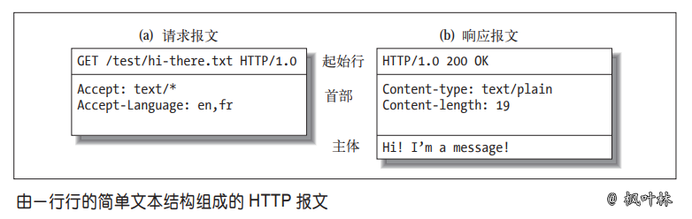
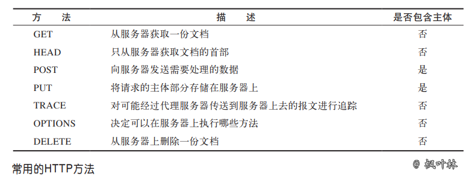
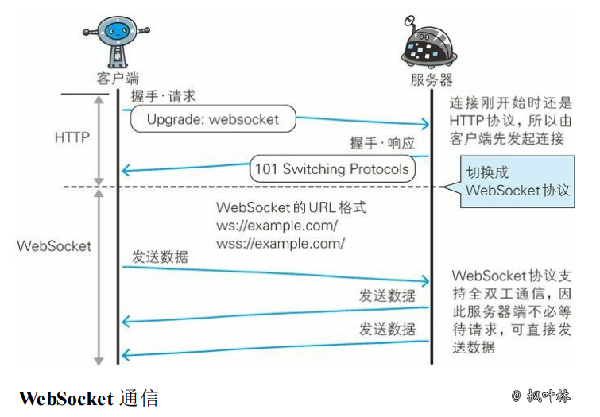

# 问题与简答

## 网络篇

leo
之前都是从一个面试者角度出发的，现在从面试官角度出发，问网络问题，这样问。

q: 详细讲一下从在浏览器输入一个地址，到返回页面，整个过程？

这个问题，根据对方的组织能力和是否条理清楚可以看出来，是不是求职者是不是有结构化思考。

如果第一个回答的不错，可以在任意一个部分继续详细的问下去。

第一个如果回答的标准一些可以参考如下的文章，但是这个也不好，太精简了，在面试回答问题的时候可以多思考一些简单说一些，可以让面试官对自己的印象更好。

整体分5部分：

1. 建立tcp连接
2. 发送http请求
3. 服务器接受处理，并返回处理的response
4. 释放tcp连接
5. 客户端浏览器解析http内容

## 1、客户端连接到Web服务器 HTTP客户端
通常是浏览器，与Web服务器的HTTP端口（默认80）建立一个TCP连接。

ps：这里可以说下他是基于tcp建立一个tcp连接，获取ip地址是通过dns解析。

> 面试官也可能会问：
1. dns基于什么协议？    （udp）
2. tcp和udp有什么区别？  （见下文）
3. 三次握手详细讲讲，为什么需要最少需要三次？
4. 公网ip不够是怎么解决的，在哪一层？

[上面问题解答](./01.%E7%BD%91%E7%BB%9C/01.1.%E5%88%9B%E5%BB%BA%E9%93%BE%E6%8E%A5.md)

## 2、发送HTTP请求
客户端向Web服务器发送一个请求报文，一个请求报文由请求行、请求头部、空行和请求数据组成。

行只有一行，头是多个键值对，空行，请求数据（可以为空）

> 面试官如果对这个感兴趣，或者回答的时候引导面试官去问这些问题，可能会问的问题有：

1. 请求行是哪三部分组成？   
2. 一共有多少种请求方式
3. get vs post？
4. http协议有几个？ 1.1 和 2.0 有什么区别？还有其他的协议吗？
5. 常见的请求头部有什么？
6. http 有什么优缺点
7. http vs rpc？
8. post为什么是两个数据包？

[上面问题解答](./01.%E7%BD%91%E7%BB%9C/01.2.%E5%8F%91%E9%80%81http%E8%AF%B7%E6%B1%82.md)

## 3、服务器接受请求并返回HTTP响应
 Web服务器解析请求，定位请求资源。服务器将资源复本写到TCP套接字，由客户端读取。一个响应由状态行、响应头部、空行和响应数据组成。

> 面试官会问：
1. 状态码相关？大的划分？然后是302 304区别？工作中遇到过什么，怎么解决？
2. 常见的响应头部有什么？

[上面问题解答](./01.%E7%BD%91%E7%BB%9C/01.3.%20http%E5%A4%84%E7%90%86%E5%92%8C%E5%93%8D%E5%BA%94%E9%98%B6%E6%AE%B5.md)

## 4、释放连接TCP连接
 若connection 模式为close，则服务器主动关闭TCP连接，客户端被动关闭连接，释放TCP连接;若connection 模式为keepalive，则该连接会保持一段时间，在该时间内可以继续接收请求。

> 面试官可能会问：
1. 四次挥手？
2. 休眠2mls？

[上面问题解答](./01.%E7%BD%91%E7%BB%9C/01.4.%20%E6%96%AD%E5%BC%80%E8%BF%9E%E6%8E%A5%E9%98%B6%E6%AE%B5%20copy.md)

## 5、客户端浏览器解析HTML内容
 客户端浏览器首先解析状态行，查看表明请求是否成功的状态代码。然后解析每一个响应头，响应头告知以下为若干字节的HTML文档和文档的字符集。客户端浏览器读取响应数据HTML，根据HTML的语法对其进行格式化，并在浏览器窗口中显示。

### 范问题
> 面试官还会问：
1. http vs https
2. 计算机网络体系结构 7层，5层是什么意思
3. http是干什么用的？
4. telnet 怎么模拟发送http请求？每一个部分相当于刚才讲的5个部分中的哪一个部分？

[上面问题解答](./01.%E7%BD%91%E7%BB%9C/01.x.%E7%BD%91%E7%BB%9Chttp%E8%8C%83%E9%97%AE%E9%A2%98.md)

> 附带原来的原文
## 求职者
### 1. 计算机网络体系结构

#### 各层作用

- 应用层：应用层协议定义的是应用进程间通信和交互的规则
- 运输层：运输层的任务就是负责向`两台主机中进程之间的通信`提供`通用的数据传输`服务
- 网络层：把运输层产生的报文段或用户数据报封装成`分组`或`包`进行传送
- 数据链路层：将网络层交下来的 IP 数据报组装成帧，并在两个相邻结点间的链路上传送
- 物理层：利用物理媒体以`比特`形式传送数据

拓展阅读 [《计算机网络体系结构》](./01.网络/01.计算机网络体系结构.md)

### 2. UDP 的主要特点

- UDP 是`无连接的`，即发送数据之前不需要建立连接(发送数据结束时也没有连接可释放)，减少了开销和发送数据之前的时延
- UDP 使用`尽最大努力交付`，即不保证可靠交付，主机不需要维持复杂的连接状态表
- UDP 是`面向报文`的，发送方的 UDP 对应用程序交下来的报文，在添加首部后就向下交付 IP 层。UDP 对应用层交下来的报文，既不合并，也不拆分，而是`保留这些报文的边界`
- UDP `没有拥塞控制`，网络出现的拥塞不会使源主机的发送速率降低。这对某些实时应用是很重要的
- UDP 支持一对一、一对多、多对一和多对多的交互通信
- UDP 的`首部开销小`，只有8个字节，比 TCP 的20个字节的首部要短

拓展阅读 [《用户数据报协议 UDP》](./01.网络/02.用户数据报协议UDP.md)

### 3. TCP 的主要特点

- TCP 是`面向连接的运输层协议`。应用程序在使用 TCP 协议之前，必须先建立 TCP 连接。在传送数据完毕后，必须释放已经建立的 TCP 连接
- 每一条 TCP 连接只能有两个`端点`，每一条 TCP 连接只能是`点对点`的(一对一)
- TCP 提供`可靠交付`的服务。通过 TCP 连接传送的数据，无差错、不丢失、不重复，并且按序到达
- TCP 提供`全双工通信`。TCP 允许通信双方的应用进程在任何时候都能发送数据。TCP 连接的两端都设有发送缓存和接受缓存，用来临时存放双向通信的数据
- `面向字节流`。TCP 中的“流”指的是`流入到进程或从进程流出的字节序列`

拓展阅读 [《传输控制协议 TCP》](./01.网络/03.传输控制协议TCP.md)

### 4. 简述三报文握手建立 TCP 连接

- 服务器进程先创建传输控制块 TCB，并处于监听状态，等待客户端的连接请求;此时状态为LISTEN
- 客户端创建传输控制块 TCB，并向服务器发出连接请求报文段SYN,此时状态为SYN-SEND
- 服务器收到连接请求报文段后，如同意建立连接，则发送确认报文段ACK,此时状态为SYN-RECV，并且客户端链接进入半链接队列，系统参数/proc/sys/net/ipv4/tcp_max_syn_backlog
- 客户端进程收到服务器的确认报文段后，立即回复确认报文段ACK，并进入已建立连接状态，此时状态为ESTABLISHED
- 服务器收到确认报文段之后，也进入已建立连接状态，此时状态为ESTABLISHED，并且客户端链接进入全连接队列，系统参数/proc/sys/net/core/somaxconn

> 传输控制块 TCB(Transmission Control Block)存储了每一个连接中的一些重要信息

### 5. 建立 TCP 连接为什么最后还要发送确认

这主要是为了防止已失效的连接请求报文段突然又传到了 TCP 服务器，避免产生错误
简述为了保证数据的正确性和顺序

### 6. 简述 TCP 连接的释放

- 客户端应用进程发出连接释放报文段，并停止再发送数据，进入 FIN-WAIT-1(终止等待1)状态，等待服务器确认
- 服务器收到连接释放报文段后即发出确认，进入 CLOSE-WAIT(关闭等待)状态，服务器若发送数据，客户端扔要接收
- 客户端收到来自服务器的确认后，进入 FIN-WAIT-2(终止等待2)状态，等待服务器发出连接释放报文段
- 服务器没有要发送的数据，发出连接释放报文段，进入 LAST-ACK(最后确认)状态，等待客户端确认
- 客户端收到连接释放报文段后，发出确认，进入 TIME-WAIT(时间等待)状态，经过时间等待计时器设置的时间 2MSL 后，进入 CLOSED(关闭) 状态
- 服务器收到客户端报文段后，进入 CLOSED 状态

### 7. TIME-WAIT 是什么，为什么必须等待 2MLS

TIME-WAIT 是一种 TCP 状态。等待 2MLS 可以保证客户端最后一个报文段能够到达服务器，如果未到达，服务器则会超时重传连接释放报文段，使得客户端、服务器都可以正常进入到 CLOSE(关闭) 状态

### 8. TCP 粘包问题

#### 粘包问题

在 TCP 这种字节流协议上做`应用层分包`是网络编程的基本需求。分包指的是在发生一个消息(message)或一帧(frame)数据时，通过一定的处理，让接收方能从字节流中识别并截取(还原)出一个个消息。因此，“粘包问题”是个伪命题

#### 长连接分包

- 消息长度固定
- 使用特殊的字符或字符串作为消息的边界，例如 HTTP 协议的 headers 以“\r\n”为字段的分隔符
- 在每条消息的头部加一个长度字段，这恐怕是最常见的做法
- 利用消息本身的格式来分包，例如 XML 格式的消息中 `<root>`...`</root>` 的配对，或者 JSON 格式中的 { ... } 的配对。解析这种消息格式通常会用到状态机(state machine)

拓展阅读 [《TCP粘包拆包》](./01.网络/04.TCP粘包拆包.md)

### 9. UDP、TCP 区别，适用场景

|对比项|UDP|TCP|
|-|-|-|
|连接性|无连接|面向连接|
|可靠性|不可靠|可靠|
|报文|面向报文-数据报模式|面向字节流-流模式|
|双工性|一对一、一对多、多对一、多对多|全双工|
|流量控制|无|有(滑动窗口)|
|拥塞控制|无|有(慢开始、拥塞避免、快重传、快恢复)|
|传输速度|快|慢|
|资源要求|较少|较多|
|首部开销|8字节|20字节|
|数据顺序|不保证|保证|

#### UDP 适用场景

面向数据报方式、网络数据大多为短消息、拥有大量 Client、对数据安全性无特殊要求、网络负担非常重，但对响应速度要求高
流媒体协议（直播）、实时游戏……
#### TCP 适用场景

- 文件传输(FTP HTTP 对数据准确性要求较高，速度可以相对慢)
- 发送或接收邮件(POP IMAP SMTP 对数据准确性要求高，非紧急应用)
- 远程登录(telnet SSH 对数据准确性有要求，有连接的概念)

### 10. 建立 socket 需要哪些步骤

- 创建 socket
- 绑定 socket 到指定地址和端口
- 开始监听连接
- 读取客户端输入
- 关闭 socket

### 11. DNS 主要作用是什么

计算机既可以被赋予 IP 地址，也可以被赋予主机名和域名。用户通常使用主机名或域名来访问对方的计算机，而不是直接通过 IP 地址访问

但要让计算机去理解名称，相对而言就变得困难，因为计算机更擅长处理一长串数字

为了解决上述问题，DNS 服务应运而生。DNS 协议提供通过域名查找 IP 地址，或逆向从 IP 地址反查域名的服务

### 12. HTTP 报文组成

HTTP 报文是由简单字符串组成，HTTP 报文都是纯文本，不是二进制代码，可以很方便地对其进行读写

从客户端发往服务器的 HTTP 报文称为`请求报文`(request message)。从服务器发往客户端的报文称为`响应报文`(response message)。HTTP 请求和响应报文的格式很类似

HTTP 报文组成部分

- 起始行：报文的第一行就是起始行，在请求报文中用来说明要做些什么，在响应报文中说明出现了什么情况
- 首部字段：起始行后面有零个或多个首部字段。每个首部字段都包含一个名字和一个值
- 主体：空行之后就是可选的报文主体了，其中包含了所有类型的数据

### 13. HTTP 状态码

> HTTP 状态码用来告诉客户端，发生了什么事情，状态码位于响应的起始行中

#### 状态码分类

|状态码|整体范围|已定义范围|分类|
|-|-|-|-|
|1XX|100~199|100~101|信息提示|
|2XX|200~299|200~206|成功|
|3XX|300~399|300~305|重定向|
|4XX|400~499|400~415|客户端错误|
|5XX|500~599|500~505|服务器错误|

#### 常见状态码

|状态码|原因短语|含义|考察概率|
|-|-|-|-|
|200|OK|请求没有问题|***|
|206|Partial Content|部分或 Range(范围) 请求|*|
|301|Moved Permanently|在请求的链接被移除时使用|**|
|302|Found|在请求临时的链接使用|**|
|304|Not Modified|资源未被修改可使用旧资源|**|
|307|Temporary Redirect|在请求临时的链接使用|**|
|400|Bad Request|告知客户端发送了错误请求|***|
|403|Forbidden|请求被服务器拒绝|***|
|404|Not Found|无法找到所请求的 URL|***|
|413|Request entiry too large|请求实体过大|*|
|500|Internal Server Error|服务器遇到错误|***|
|502|Bad Gateway|代理或网关错误(无法连接到其父网关)|***|
|503|Service Unavailable|无法为请求提供服务|***|
|504|Gateway Timeout|代理或网关超时(等待另一服务器响应超时)|***|

拓展阅读 [《HTTP状态码》](./01.网络/05.HTTP状态码.md)

拓展阅读 [《5xx系列错误》](../03.PHP/QA.md#502504-错误产生原因及解决方式)

### 14. 常见的 HTTP 方法

拓展阅读 [《HTTP方法详解》](./01.网络/06.HTTP方法详解.md)

### 15. GET 与 POST 请求方式区别

|GET|POST|
|-|-|
|后退按钮/刷新无害|数据会被重新提交|
|数据长度限制/URL长度2048字符|长度无限制（协议不限制；实际上受nginx和PHP的限制，php还会限制post报文变量的个数）|
|数据可见/安全性差|不可见/更安全|
|可以被缓存|不可以被缓存|
|书签可收藏|书签不可收藏|
|产生一个TCP数据包| 产生两个TCP数据包 |

### 16. HTTP 优缺点

基于应用级的接口，使用方便
传输速度慢，数据包大；如实现实时交互，服务器性能压力大；数据传输安全性差

### 17. HTTPS 通信原理

拓展阅读 [《HTTPS细节介绍》](./01.网络/07.HTTPS细节介绍.md)

### 18. HTTP 2.0

多路复用、客户端拉拽/服务器推送、流量控制、WebSocket

### 19. WebSocket

WebSocket 是一种通信协议，定义了一个全双工通信信道，仅通过 Web 上的一个 Socket 即可进行通信

#### 主要特点

- 推送功能：支持由服务器向客户端推送数据的推送功能
- 减少通信量：只要建立起 WebSocket 连接，就希望一直保持连接状态

### 20. IPv6 与 IPv4 有什么变化

更大的地址空间、扩展的地址层次结构、灵活的首部格式、改进的选项、允许协议继续扩充、支持资源的预分配

### 21. 什么是心跳机制

心跳机制是定时发送一个自定义的结构体(心跳包)，让对方知道自己还活着，以确保连接的有效性的机制

### 22. 什么是长连接

长连接，指在一个连接上可以连续发送多个数据包，在连接保持期间，如果没有数据包发送，需要双方发链路检测包
