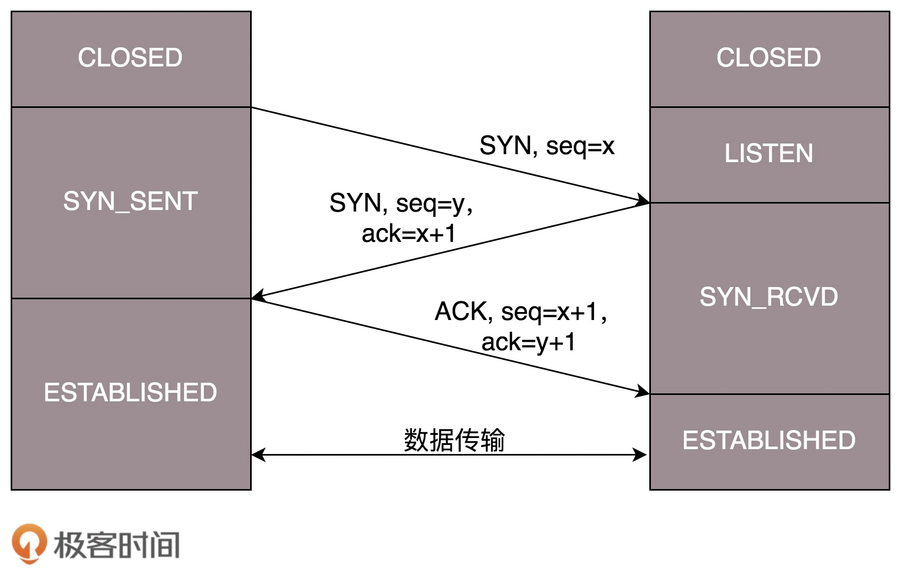
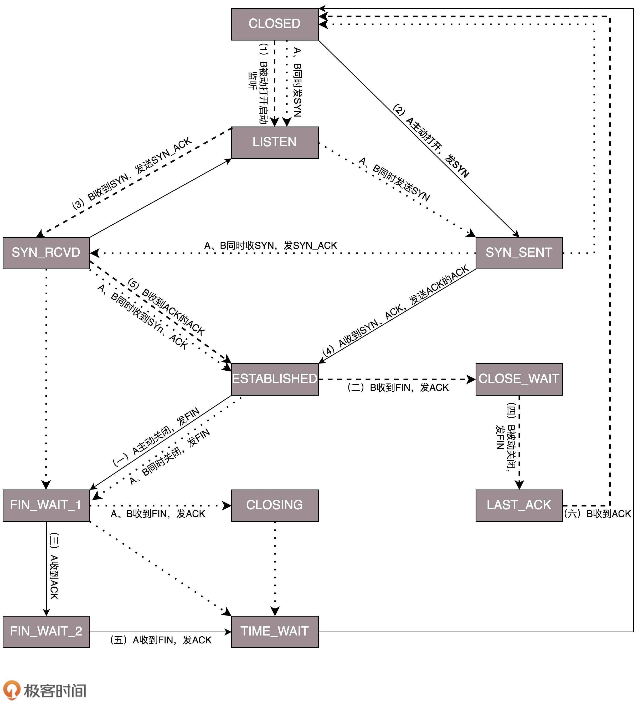
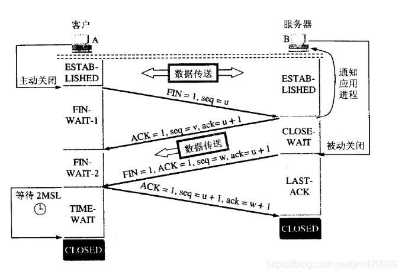

# 问题：
1. 四次挥手？
2. 休眠2mls？

## 解答：
## 1. 四次挥手？
## 2. 休眠2mls？
这里极客时间讲的还不错，下面的前两个图都是极客时间的。

一开始，客户端和服务端都处于 CLOSED 状态。先是服务端主动监听某个端口，处于 LISTEN 状态。然后客户端主动发起连接 SYN，之后处于 SYN-SENT 状态。服务端收到发起的连接，返回 SYN，并且 ACK 客户端的 SYN，之后处于 SYN-RCVD 状态。客户端收到服务端发送的 SYN 和 ACK 之后，发送 ACK 的 ACK，之后处于 ESTABLISHED 状态，因为它一发一收成功了。服务端收到 ACK 的 ACK 之后，处于 ESTABLISHED 状态，因为它也一发一收了。

### TCP 四次挥手

好了，说完了连接，接下来说一说“拜拜”，好说好散。这常被称为四次挥手。

A：B 啊，我不想玩了。

B：哦，你不想玩了啊，我知道了。

这个时候，还只是 A 不想玩了，也即 A 不会再发送数据，但是 B 能不能在 ACK 的时候，直接关闭呢？

当然不可以了，很有可能 A 是发完了最后的数据就准备不玩了，但是 B 还没做完自己的事情，还是可以发送数据的，所以称为半关闭的状态。

这个时候 A 可以选择不再接收数据了，也可以选择最后再接收一段数据，等待 B 也主动关闭。

B：A 啊，好吧，我也不玩了，拜拜。

A：好的，拜拜。

这样整个连接就关闭了。

但是这个过程有没有异常情况呢？当然有，上面是和平分手的场面。

A 开始说“不玩了”，B 说“知道了”，这个回合，是没什么问题的，因为在此之前，双方还处于合作的状态，如果 A 说“不玩了”，没有收到回复，则 A 会重新发送“不玩了”。

但是这个回合结束之后，就有可能出现异常情况了，因为已经有一方率先撕破脸。

一种情况是，A 说完“不玩了”之后，直接跑路，是会有问题的，因为 B 还没有发起结束，而如果 A 跑路，B 就算发起结束，也得不到回答，B 就不知道该怎么办了。

另一种情况是，A 说完“不玩了”，B 直接跑路，也是有问题的，因为 A 不知道 B 是还有事情要处理，还是过一会儿会发送结束。

那怎么解决这些问题呢？

TCP 协议专门设计了几个状态来处理这些问题。

我们来看断开连接的时候的状态时序图。

断开的时候，我们可以看到，当 A 说“不玩了”，就进入 FIN_WAIT_1 的状态，B 收到“A 不玩”的消息后，发送知道了，就进入 CLOSE_WAIT 的状态。

A 收到“B 说知道了”，就进入 FIN_WAIT_2 的状态，如果这个时候 B 直接跑路，则 A 将永远在这个状态。TCP 协议里面并没有对这个状态的处理，但是 Linux 有，可以调整 tcp_fin_timeout 这个参数，设置一个超时时间。

如果 B 没有跑路，发送了“B 也不玩了”的请求到达 A 时，A 发送“知道 B 也不玩了”的 ACK 后，从 FIN_WAIT_2 状态结束，按说 A 可以跑路了，但是最后的这个 ACK 万一 B 收不到呢？则 B 会重新发一个“B 不玩了”，这个时候 A 已经跑路了的话，B 就再也收不到 ACK 了，因而 TCP 协议要求 A 最后等待一段时间 TIME_WAIT，这个时间要足够长，长到如果 B 没收到 ACK 的话，“B 说不玩了”会重发的，A 会重新发一个 ACK 并且足够时间到达 B。

A 直接跑路还有一个问题是，A 的端口就直接空出来了，但是 B 不知道，B 原来发过的很多包很可能还在路上，如果 A 的端口被一个新的应用占用了，这个新的应用会收到上个连接中 B 发过来的包，虽然序列号是重新生成的，但是这里要上一个双保险，防止产生混乱，因而也需要等足够长的时间，等到原来 B 发送的所有的包都死翘翘，再空出端口来。

等待的时间设为 2MSL，MSL 是 Maximum Segment Lifetime，报文最大生存时间，它是任何报文在网络上存在的最长时间，超过这个时间报文将被丢弃。因为 TCP 报文基于是 IP 协议的，而 IP 头中有一个 TTL 域，是 IP 数据报可以经过的最大路由数，每经过一个处理他的路由器此值就减 1，当此值为 0 则数据报将被丢弃，同时发送 ICMP 报文通知源主机。协议规定 MSL 为 2 分钟，实际应用中常用的是 30 秒，1 分钟和 2 分钟等。

还有一个异常情况就是，B 超过了 2MSL 的时间，依然没有收到它发的 FIN 的 ACK，怎么办呢？按照 TCP 的原理，B 当然还会重发 FIN，这个时候 A 再收到这个包之后，A 就表示，我已经在这里等了这么长时间了，已经仁至义尽了，之后的我就都不认了，于是就直接发送 RST，B 就知道 A 早就跑了。

### TCP 状态机

将连接建立和连接断开的两个时序状态图综合起来，就是这个著名的 TCP 的状态机。学习的时候比较建议将这个状态机和时序状态机对照着看，不然容易晕。

在这个图中，加黑加粗的部分，是上面说到的主要流程，其中阿拉伯数字的序号，是连接过程中的顺序，而大写中文数字的序号，是连接断开过程中的顺序。加粗的实线是客户端 A 的状态变迁，加粗的虚线是服务端 B 的状态变迁。

### 为什么必须等2msl总结

- 为了A发送的最后一个ACK报文能到达B，如果不等可能B就无法正常进入到CLOSED状态。
- 等2MSL时间，这个链接种所有的报文都会从网络中消失，这样不会有新连接收到接连接的请求报文

第一，为了保证A发送的最后一个ACK报文能够到达B。

这个ACK报文段有可能丢失，因而使处在LAST-ACK状态的B收不到对已发送的FIN+ACK报文段的确认。

B会超时重传这个FIN+ACK报文段，而A就能在2MSL时间内收到这个重传的FIN+ACK报文段。

如果A在TIME-WAIT状态不等待一段时间，而是在发送完ACK报文段后就立即释放连接，就无法收到B重传的FIN+ACK报文段，因而也不会再发送一次确认报文段。

这样，B就无法按照正常的步骤进入CLOSED状态。

第二，A在发送完ACK报文段后，再经过2MSL时间，就可以使本连接持续的时间所产生的所有报文段都从网络中消失。这样就可以使下一个新的连接中不会出现这种旧的连接请求的报文段。

### 什么是MSL？
MSL是Maximum Segment Lifetime英文的缩写，中文可以译为“报文最大生存时间”，他是任何报文在网络上存在的最长时间，超过这个时间报文将被丢弃。

