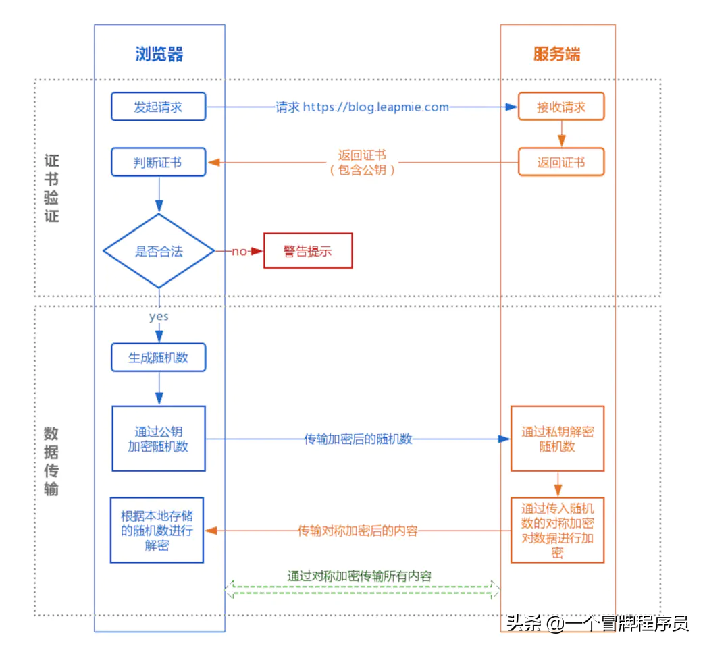
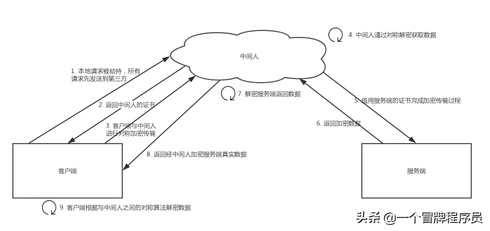

# 问题

01.  
0. TLS 1.2与TLS 1.3对比总结
1. http vs https
2. 计算机网络体系结构 7层，5层是什么意思
3. http是干什么用的？

[字节一面：HTTPS 一定安全可靠吗？](https://www.51cto.com/article/716686.html)

## 对 HTTPS 优化
[字节二面：优化HTTPS的手段，你知道几个？](https://www.51cto.com/article/642795.html)

分析性能损耗既然要对 HTTPS 优化，那得清楚哪些步骤会产生性能消耗，再对症下药。

产生性能消耗的两个环节：

第一个环节， TLS 协议握手过程;
第二个环节，握手后的对称加密报文传输。

对于第二环节，现在主流的对称加密算法 AES、ChaCha20 性能都是不错的，而且一些 CPU 厂商还针对它们做了硬件级别的优化，因此这个环节的性能消耗可以说非常地小。

而第一个环节，TLS 协议握手过程不仅增加了网络延时(最长可以花费掉 2 RTT)，而且握手过程中的一些步骤也会产生性能损耗，比如：

### 优化方法：

1. 硬件优化
   一个好的 CPU，可以提高计算性能
2. 软件优化 
#### 软件升级
- 将 Linux 内核从 2.x 升级到 4.x;
- 将 OpenSSL 从 1.0.1 升级到 1.1.1;
#### 协议优化
- 密钥交换算法优化
- TLS 升级

3. 证书优化
  证书传输优化

  证书验证优化 
4. 会话复用
   
### 总结
#### 对于硬件优化的方向
因为 HTTPS 是属于计算密集型，应该选择计算力更强的 CPU，而且最好选择支持 AES-NI 特性的 CPU，这个特性可以在硬件级别优化 AES 对称加密算法，加快应用数据的加解密。

#### 对于软件优化的方向
如果可以，把软件升级成较新的版本，比如将 Linux 内核 2.X 升级成 4.X，将 openssl 1.0.1 升级到 1.1.1，因为新版本的软件不仅会提供新的特性，而且还会修复老版本的问题。

#### 对于协议优化的方向：

密钥交换算法应该选择 ECDHE 算法，而不用 RSA 算法，因为 ECDHE 算法具备前向安全性，而且客户端可以在第三次握手之后，就发送加密应用数据，节省了 1 RTT。

将 TSL1.2 升级 TSL1.3，因为 TSL1.3 的握手过程只需要 1 RTT，而且安全性更强。

#### 对于证书优化的方向：

服务器应该选用 ECDSA 证书，而非 RSA 证书，因为在相同安全级别下，ECC 的密钥长度比 RSA 短很多，这样可以提高证书传输的效率;

服务器应该开启 OCSP Stapling 功能，由服务器预先获得 OCSP 的响应，并把响应结果缓存起来，这样 TLS 握手的时候就不用再访问 CA 服务器，减少了网络通信的开销，提高了证书验证的效率;

对于重连 HTTPS 时，我们可以使用一些技术让客户端和服务端使用上一次 HTTPS 连接使用的会话密钥，直接恢复会话，而不用再重新走完整的 TLS 握手过程。

常见的会话重用技术有 Session ID 和 Session Ticket，用了会话重用技术，当再次重连 HTTPS 时，只需要 1 RTT 就可以恢复会话。对于 TLS1.3 使用 Pre-shared Key 会话重用技术，只需要 0 RTT 就可以恢复会话。

这些会话重用技术虽然好用，但是存在一定的安全风险，它们不仅不具备前向安全，而且有重放攻击的风险，所以应当对会话密钥设定一个合理的过期时间。   

## TLS 1.2与TLS 1.3对比总结
相比TLSv1.2，TLSv1.3主要的优势如下：

性能提升：完全握手场景下，TLSv1.3握手消耗1-RTT；会话复用的场景，TLSv1.3握手消耗0-RTT；均比TLSv1.2少一个RTT。

安全提升：TLSv1.3完全支持PFS（即完全前向安全）的密钥交换算法；禁用有安全漏洞的加密套件；对ServerHello消息之后的握手信息加密。

## 1. http vs https
HTTPS 协议（HyperText Transfer Protocol over Secure Socket Layer）：一般理解为HTTP+SSL/TLS，通过 SSL证书来验证服务器的身份，并为浏览器和服务器之间的通信进行加密。
那么SSL又是什么？

SSL（Secure Socket Layer，安全套接字层）：1994年为 Netscape 所研发，SSL 协议位于 TCP/IP 协议与各种应用层协议之间，为数据通讯提供安全支持。

TLS（Transport Layer Security，传输层安全）：其前身是 SSL，它最初的几个版本（SSL 1.0、SSL 2.0、SSL 3.0）由网景公司开发，1999年从 3.1 开始被 IETF 标准化并改名，发展至今已经有 TLS 1.0、TLS 1.1、TLS 1.2 三个版本。SSL3.0和TLS1.0由于存在安全漏洞，已经很少被使用到。TLS 1.3 改动会比较大，目前还在草案阶段，目前使用最广泛的是TLS 1.1、TLS 1.2。

整个过程如下：
1. 首先客户端通过URL访问服务器建立SSL连接。
2. 服务端收到客户端请求后，会将网站支持的证书信息（证书中包含公钥）传送一份给客户端。
3. 客户端的服务器开始协商SSL连接的安全等级，也就是信息加密的等级。
4. 客户端的浏览器根据双方同意的安全等级，建立会话密钥，然后利用网站的公钥将会话密钥加密，并传送给网站。
5. 服务器利用自己的私钥解密出会话密钥。
6. 服务器利用会话密钥加密与客户端之间的通信。
   
### HTTPS的缺点
- HTTPS协议多次握手，导致页面的加载时间延长近50%
- HTTPS连接缓存不如HTTP高效，会增加数据开销和功耗
- 申请SSL证书需要钱，功能越强大的证书费用越高
- SSL涉及到的安全算法会消耗 CPU 资源，对服务器资源消耗较大
  
### http 和https区别
协议上，https 相当于http+ssl/tls。
- HTTPS是HTTP协议的安全版本
- HTTP协议的数据传输是明文的，是不安全的，HTTPS使用了SSL/TLS协议进行了加密处理
- http和https使用连接方式不同
- 默认端口不一样，http是80，https是443。

## 2. 计算机网络体系结构 7层，5层是什么意思

## 3. http是干什么用的？
首先要明确HTTP 是一个协议，是一个超文本传输协议。

它基于 TCP/IP 来传输文本、图片、视频、音频等。

重点来了。

HTTP 不提供数据包的传输功能，也就是数据包从浏览器到服务端再来回的传输和它没关系。

这是 TCP/IP 干的。

所以说 HTTP 它规定了一种格式，一种通信格式，大家都用这个格式来交谈。

这样不论你是什么服务器、什么浏览器都能顺利的交流，减少交互的成本。

所以 HTTP 的本质是什么？

就是客户端和服务端约定好的一种通信格式。

# https 真的安全吗？可以抓包吗？如何防止抓包吗?
## 前言
转眼间，2020 年已过去一大半了，2020 年很难，各企业裁员的消息蛮多的，降职，不发年终奖等等。

2020 年确实是艰难的一年。然而生活总是要继续，时间不给你丧的机会！如果我们能坚持下来，不断提高自己，说不定会有新的机会。

面试中，网络（http， https， tcp， udp）， jvm， 类加载机制等这些基础的知识点是高频出现的，每个程序员都能说上好多。但不一定说到重点，以及理解背后的原理。

我在面试的过程中也经常被问到，于是总结记录了下来。千万不要小瞧这些基础，有时候，你算法，项目经验都过了，但是基础答得不太好。结果可能会通过，但这肯定会影响你的评级，这是特别吃亏的。所以，不如花点时间背一下，理解一下背后的原理。

举一个简单的例子， https 连接过程是怎样的，使用了了哪种加密方式，可以抓包吗，怎样防止抓包，你是否能够对答如下。

废话不多说，开始进入正文。

## 背景

我们知道，http 通信存在以下问题：

1. 通信使用明文可能会被窃听
2. 不验证通信方的身份可能遭遇伪装
3. 无法证明报文的完整型，可能已遭篡改
4. 使用 https 可以解决数据安全问题，但是你真的理解 https 吗？

> 当面试官连续对你发出灵魂追问的时候，你能对答如流吗

1. 什么是 https，为什么需要 https
2. https 的连接过程
3. https 的加密方式是怎样的，对称加密和非对称加密，为什么要这样设计？内容传输为什么要使用对称机密
4. https 是绝对安全的吗
5. https 可以抓包吗
6. 如果你能对答自如，恭喜你，https 你已经掌握得差不多了，足够应付面试了。

## 什么是 https
简单来说， https 是 http + ssl，对 http 通信内容进行加密，是HTTP的安全版，是使用TLS/SSL加密的HTTP协议

Https的作用：

1. 内容加密 建立一个信息安全通道，来保证数据传输的安全；
2. 身份认证 确认网站的真实性
3. 数据完整性 防止内容被第三方冒充或者篡改

## 什么是SSL
SSL 由 Netscape 公司于1994年创建，它旨在通过Web创建安全的Internet通信。它是一种标准协议，用于加密浏览器和服务器之间的通信。它允许通过Internet安全轻松地传输账号密码、银行卡、手机号等私密信息。

SSL证书就是遵守SSL协议，由受信任的CA机构颁发的数字证书。

SSL/TLS的工作原理:

需要理解SSL/TLS的工作原理，我们需要掌握加密算法。加密算法有两种：对称加密和非对称加密：

对称加密：通信双方使用相同的密钥进行加密。特点是加密速度快，但是缺点是需要保护好密钥，如果密钥泄露的话，那么加密就会被别人pojie。常见的对称加密有AES，DES算法。

非对称加密：它需要生成两个密钥：公钥(Public Key)和私钥(Private Key)。

公钥顾名思义是公开的，任何人都可以获得，而私钥是私人保管的。相信大多程序员已经对这种算法很熟悉了：我们提交代码到github的时候，就可以使用SSH key：在本地生成私钥和公钥，私钥放在本地.ssh目录中，公钥放在github网站上，这样每次提交代码，不用麻烦的输入用户名和密码了，github会根据网站上存储的公钥来识别我们的身份。

公钥负责加密，私钥负责解密；或者，私钥负责加密，公钥负责解密。这种加密算法安全性更高，但是计算量相比对称加密大很多，加密和解密都很慢。常见的非对称算法有RSA。

## https 的连接过程

https 的连接过程大概分为两个阶段，证书验证阶段和数据传输阶段

## 证书验证阶段
大概分为三个步骤:

1. 浏览器发起请求
2. 服务器接收到请求之后，会返回证书，包括公钥
3. 浏览器接收到证书之后，会检验证书是否合法，不合法的话，会弹出告警提示（怎样验证合法，下文会详细解析，这里先忽略）

## 数据传输阶段 
证书验证合法之后

1. 浏览器会生成一个随机数，
2. 使用公钥进行加密，发送给服务端
3. 服务器收到浏览器发来的值，使用私钥进行解密
4. 解析成功之后，使用对称加密算法进行加密，传输给客户端
   
之后双方通信就使用第一步生成的随机数进行加密通信。

## https 的加密方式是怎样的，对称加密和非对称加密，为什么要这样设计
从上面我们可以知道，https 加密是采用对称加密和非对称机密一起结合的。

在证书验证阶段，使用非对称加密。 在数据传输阶段，使用对称机密。

这样设计有一个好处，能最大程度得兼顾安全效率。

在证书验证阶段，使用非对称加密，需要公钥和私钥，假如浏览器的公钥泄漏了，我们还是能够确保随机数的安全，因为加密的数据只有用私钥才能解密。这样能最大程度确保随机数的安全。

在内容传输阶段，使用对称机密，可以大大提高加解密的效率。

## 内容传输为什么要使用对称机密
1. 对称加密效率比较高
2. 一对公私钥只能实现单向的加解密。只有服务端保存了私钥。如果使用非对称机密，相当于客户端必须有自己的私钥，这样设计的话，每个客户端都有自己的私钥，这很明显是不合理的，因为私钥是需要申请的。

## https 是绝对安全的吗
不是绝对安全的，可以通过中间人攻击。

## 什么是中间人攻击

中间人攻击是指攻击者与通讯的两端分别创建独立的联系，并交换其所收到的数据，使通讯的两端认为他们正在通过一个私密的连接与对方直接对话，但事实上整个会话都被攻击者完全控制。

HTTPS 使用了 SSL 加密协议，是一种非常安全的机制，目前并没有方法直接对这个协议进行攻击，一般都是在建立 SSL 连接时，拦截客户端的请求，利用中间人获取到 CA证书、非对称加密的公钥、对称加密的密钥；有了这些条件，就可以对请求和响应进行拦截和篡改。

过程原理：

1. 本地请求被劫持（如DNS劫持等），所有请求均发送到中间人的服务器
2. 中间人服务器返回中间人自己的证书
3. 客户端创建随机数，通过中间人证书的公钥对随机数加密后传送给中间人，然后凭随机数构造对称加密对传输内容进行加密传输
4. 中间人因为拥有客户端的随机数，可以通过对称加密算法进行内容解密
5. 中间人以客户端的请求内容再向官方网站发起请求
6. 因为中间人与服务器的通信过程是合法的，官方网站通过建立的安全通道返回加密后的数据
7. 中间人凭借与官方网站建立的对称加密算法对内容进行解密
8. 中间人通过与客户端建立的对称加密算法对官方内容返回的数据进行加密传输
9. 客户端通过与中间人建立的对称加密算法对返回结果数据进行解密

由于缺少对证书的验证，所以客户端虽然发起的是 HTTPS 请求，但客户端完全不知道自己的网络已被拦截，传输内容被中间人全部窃取。

## https 是如何防止中间人攻击的
在https中需要证书，证书的作用是为了防止"中间人攻击"的。 如果有个中间人M拦截客户端请求,然后M向客户端提供自己的公钥，M再向服务端请求公钥,作为"中介者" 这样客户端和服务端都不知道,信息已经被拦截获取了。这时候就需要证明服务端的公钥是正确的.

怎么证明呢?

就需要权威第三方机构来公正了.这个第三方机构就是CA. 也就是说CA是专门对公钥进行认证，进行担保的，也就是专门给公钥做担保的担保公司。 全球知名的CA也就100多个，这些CA都是全球都认可的，比如VeriSign、GlobalSign等，国内知名的CA有WoSign。

## 浏览器是如何确保CA证书的合法性？
一、证书包含什么信息？

颁发机构信息、公钥、公司信息、域名、有效期、指纹......

二、证书的合法性依据是什么？

首先，权威机构是要有认证的，不是随便一个机构都有资格颁发证书，不然也不叫做权威机构。另外，证书的可信性基于信任制，权威机构需要对其颁发的证书进行信用背书，只要是权威机构生成的证书，我们就认为是合法的。所以权威机构会对申请者的信息进行审核，不同等级的权威机构对审核的要求也不一样，于是证书也分为免费的、便宜的和贵的。

三、浏览器如何验证证书的合法性？

浏览器发起HTTPS请求时，服务器会返回网站的SSL证书，浏览器需要对证书做以下验证：

1. 验证域名、有效期等信息是否正确。证书上都有包含这些信息，比较容易完成验证；
2. 判断证书来源是否合法。每份签发证书都可以根据验证链查找到对应的根证书，操作系统、浏览器会在本地存储权威机构的根证书，利用本地根证书可以对对应机构签发证书完成来源验证；
3. 判断证书是否被篡改。需要与CA服务器进行校验；
4. 判断证书是否已吊销。通过CRL（Certificate Revocation List 证书注销列表）和 OCSP（Online Certificate Status Protocol 在线证书状态协议）实现，其中 OCSP 可用于第3步中以减少与CA服务器的交互，提高验证效率。

以上任意一步都满足的情况下浏览器才认为证书是合法的。

## https 可以抓包吗
HTTPS 的数据是加密的，常规下抓包工具代理请求后抓到的包内容是加密状态，无法直接查看。

但是，我们可以通过抓包工具来抓包。它的原理其实是模拟一个中间人。

通常 HTTPS 抓包工具的使用方法是会生成一个证书，用户需要手动把证书安装到客户端中，然后终端发起的所有请求通过该证书完成与抓包工具的交互，然后抓包工具再转发请求到服务器，最后把服务器返回的结果在控制台输出后再返回给终端，从而完成整个请求的闭环。

关于 httpps 抓包的原理可以看这一篇文章。

Android平台HTTPS抓包解决方案及问题分析

有人可能会问了，既然 HTTPS 不能防抓包，那 HTTPS 有什么意义？

HTTPS 可以防止用户在不知情的情况下通信链路被监听，对于主动授信的抓包操作是不提供防护的，因为这个场景用户是已经对风险知情。要防止被抓包，需要采用应用级的安全防护，例如采用私有的对称加密，同时做好移动端的防反编译加固，防止本地算法被pojie。

## 扩展
## 如何防止抓包？
对于HTTPS API接口，如何防止抓包呢？既然问题出在证书信任问题上，那么解决方法就是在我们的APP中预置证书。在TLS/SSL握手时，用预置在本地的证书中的公钥校验服务器的数字签名，只有签名通过才能成功握手。由于数字签名是使用私钥生成的，而私钥只掌握在我们手上，中间人无法伪造一个有效的签名，因此攻击失败，无法抓包。

同时，为了防止预置证书被替换，在证书存储上，可以将证书进行加密后进行「嵌入存储」，如嵌入在图片中或一段语音中。这涉及到信息隐写的领域，这个话题我们有空了详细说。

关于 Android 中Https 请求如何防止中间人攻击和Charles抓包，可以看一下这一篇文章。

Android中Https请求如何防止中间人攻击和Charles抓包原理

## 预置证书/公钥更新问题
这样做虽然解决了抓包问题，但是也带来了另外一个问题：我们购买的证书都是有有效期的，到期前需要对证书进行更新。主要有两种方式：

提供预置证书更新接口。在当前证书快过期时，APP请求获取新的预置证书，这过渡时期，两个证书同时有效，直到安全完成证书切换。这种方式有一定的维护成本，且不易测试。 在APP中只预埋公钥，这样只要私钥不变，即使证书更新也不用更新该公钥。但是，这样不太符合周期性更新私钥的安全审计需求。一个折中的方法是，一次性预置多个公钥，只要任意一个公钥验证通过即可。考虑到我们的证书一般购买周期是3-5年，那么3个公钥，可以使用9-15年，同时，我们在此期间还可以发布新版本废弃老公钥，添加新公钥，这样可以使公钥一直更新下去。

https://juejin.im/post/5f1072eb6fb9a07e6d70c445

