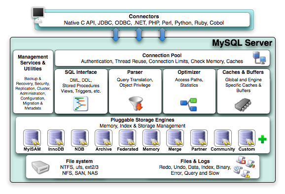

# 问题与简答

## MySQL 篇


### 隔离级别

- 未提交读(READ UNCOMMITTED)：事务中的修改，未提交，其他事务也是可见

> `脏读`(Dirty Read)：事务读取未提交的数据

- 提交读(READ COMMITTED)：事务未提交，对自己可见，两次同样查询，可能得到不同结果

- 可重复读(REPEATABLE READ)：同一个事务多次读取结果一致。解决脏读问题

> MySQL 默认事务隔离级别

- 可串行化(SERIALIZABLE)：强制事务串行执行

|隔离级别|释义|有什么问题|
|-|-|-|
|未提交读|a事务中的修改，没有提交，bcd事务也可见|脏读 因为这个可能回滚不提交|
|提交读|事务未提交仅对自己可见，查询的时候都是已经提交的数据|不可重复读，因为这个时候b事务可能提交了|
|可重复读|同一个事务多次读取结果一致|幻读，读取范围的时候b事务插入了，mysql的mvcc解决了这个问题 ✅ mysql默认是这个级别|
|可串行化|强制事务串行化执行，避免了幻读的问题|大量的超时和锁竞争，实际也很少用到|

### mvcc 多版本并发控制（leo加的）
在每一个行后面增加两个隐藏的列来实现，一个是创建时间一个是过期时间，但是真正存的不是时间，而是系统版本号。

##### select
InnoDB会根据一下两个条件检查每行记录：

 （创建时间<=当前事务系统版本号） and （过期时间=0 or 过期时间>当前事务系统版本号） 

#### insert
新插入行的 创建时间=当前事务系统版本号

#### delete
过期时间=当前事务系统版本号

#### update
其实对老数据做了delte操作，然后insert一行数据，相当于 delete+insert，参照上面两个

### inodb的索引
假设，我们有一个主键列为 ID 的表，表中有字段 k，并且在 k 上有索引。

这个表的建表语句是：mysql> create table T(id int primary key, k int not null, name varchar(16),index (k))engine=InnoDB;

表中 R1~R5 的 (ID,k) 值分别为 (100,1)、(200,2)、(300,3)、(500,5) 和 (600,6)，两棵树的示例示意图如下。


主键索引是聚簇索引。

在 InnoDB 中，表都是根据主键顺序以索引的形式存放的，这种存储方式的表称为索引组织表。又因为前面我们提到的，InnoDB 使用了 B+ 树索引模型，所以数据都是存储在 B+ 树中的。

每一个索引在 InnoDB 里面对应一棵 B+ 树。

主键索引的叶子节点存的是整行数据。在 InnoDB 里，主键索引也被称为聚簇索引（clustered index）。非主键索引的叶子节点内容是主键的值。

在 InnoDB 里，非主键索引也被称为二级索引（secondary index）。

### btree和b+tree的区别

第一个文章

 B-tree是一种多路自平衡搜索树，它类似普通的二叉树，但是Btree允许每个节点有更多的子节点。Btree示意图如下：


由上图可知 B-tree 的一些特点:

1. 所有键值分布在整个树中
2. 任何关键字出现且只出现在一个节点中
3. 搜索有可能在非叶子节点结束
4. 在关键字全集内做一次查找，性能逼近二分查找算法


所以两个的区别是：
1. 所有关键字存储在叶子节点，非叶子节点不存储真正的data
2. 为所有叶子节点增加了一个链指针
3. 每次都需要查询到叶子节点，查询性能稳定
4. 叶子节点形成有序链表，范围查询方便
~~5. 层级更低，IO 次数更少~~(对这个持怀疑态度)


b+tree特点：
1. B+Tree是在B-Tree基础上的一种优化，使其更适合实现外存储索引结构，InnoDB存储引擎就是用B+Tree实现其索引结构。
2. 从上一节中的B-Tree结构图中可以看到每个节点中不仅包含数据的key值，还有data值。
3. 而每一个页的存储空间是有限的，如果data数据较大时将会导致每个节点（即一个页）能存储的key的数量很小
4. 当存储的数据量很大时同样会导致B-Tree的深度较大，增大查询时的磁盘I/O次数，进而影响查询效率。
5. 在B+Tree中，所有数据记录节点都是按照键值大小顺序存放在同一层的叶子节点上，而非叶子节点上只存储key值信息， 这样可以大大加大每个节点存储的key值数量，降低B+Tree的高度。

其实上面的总结一下就是：数据大的时候，层级不会变的很多，可以增加每个节点存储key值的数量。


第二个文章

btree是为了磁盘或其它存储设备而设计的一种多叉平衡查找树（相对于二叉，btree每个内结点有多个分支，即多叉），而b+tree是btree的一个变种，是b+tree在数据库中的一种实现，是最常见也是数据库中使用最为频繁的一种索引。

1、btree的关键字和记录是放在一起的，叶子节点可以看作外部节点，不包含任何信息；b+tree的非叶子节点中只有关键字和指向下一个节点的索引，记录只放在叶子节点中。

2、在btree中，越靠近根节点的记录查找时间越快，只要找到关键字即可确定记录的存在；而b+tree中每个记录的查找时间基本是一样的，都需要从根节点走到叶子节点，而且在叶子节点中还要再比较关键字。

### 索引下堆
用于联合索引
比如 name like '张%' and age=10
如果有一个联合索引 name,age,在5.6之前找到所有的张回表，而5.6和之后，会过滤掉age!=10的记录。


### 索引维护（自己总结和极客时间）
[深入浅出索引下](https://time.geekbang.org/column/article/69636)

总结：
用自增数字做主键两个好处：
1. 写成本低
2. 其他索引占用空间小

写成本低是如果是无序的，可能一页不够了，插入到中间，就会产生分裂，删除后，需要合并，而如果是自增的只需要往后加页就好了，不会页分裂，参见下面的极客时间的原文。

其他索引占用空间小指的是，因为其他索引的叶子节点会存主键的值，所以主键越小，其他索引占用空间也就越小。


B+ 树为了维护索引有序性，在插入新值的时候需要做必要的维护。以上面这个图为例，如果插入新的行 ID 值为 700，则只需要在 R5 的记录后面插入一个新记录。如果新插入的 ID 值为 400，就相对麻烦了，需要逻辑上挪动后面的数据，空出位置。

而更糟的情况是，如果 R5 所在的数据页已经满了，根据 B+ 树的算法，这时候需要申请一个新的数据页，然后挪动部分数据过去。这个过程称为页分裂。在这种情况下，性能自然会受影响。

除了性能外，页分裂操作还影响数据页的利用率。原本放在一个页的数据，现在分到两个页中，整体空间利用率降低大约 50%。

当然有分裂就有合并。当相邻两个页由于删除了数据，利用率很低之后，会将数据页做合并。合并的过程，可以认为是分裂过程的逆过程。

基于上面的索引维护过程说明，我们来讨论一个案例：

> 你可能在一些建表规范里面见到过类似的描述，要求建表语句里一定要有自增主键。当然事无绝对，我们来分析一下哪些场景下应该使用自增主键，而哪些场景下不应该。

自增主键是指自增列上定义的主键，在建表语句中一般是这么定义的： NOT NULL PRIMARY KEY AUTO_INCREMENT。

插入新记录的时候可以不指定 ID 的值，系统会获取当前 ID 最大值加 1 作为下一条记录的 ID 值。

也就是说，自增主键的插入数据模式，正符合了我们前面提到的递增插入的场景。每次插入一条新记录，都是追加操作，都不涉及到挪动其他记录，也不会触发叶子节点的分裂。

而有业务逻辑的字段做主键，则往往不容易保证有序插入，这样写数据成本相对较高。

除了考虑性能外，我们还可以从存储空间的角度来看。假设你的表中确实有一个唯一字段，比如字符串类型的身份证号，那应该用身份证号做主键，还是用自增字段做主键呢？

由于每个非主键索引的叶子节点上都是主键的值。如果用身份证号做主键，那么每个二级索引的叶子节点占用约 20 个字节，而如果用整型做主键，则只要 4 个字节，如果是长整型（bigint）则是 8 个字节。

**显然，主键长度越小，普通索引的叶子节点就越小，普通索引占用的空间也就越小。**

所以，从性能和存储空间方面考量，自增主键往往是更合理的选择。

有没有什么场景适合用业务字段直接做主键的呢？

还是有的。比如，有些业务的场景需求是这样的：

- 只有一个索引；
- 该索引必须是唯一索引。
  
  你一定看出来了，这就是典型的 KV 场景。
  
  由于没有其他索引，所以也就不用考虑其他索引的叶子节点大小的问题。
  
  这时候我们就要优先考虑上一段提到的“尽量使用主键查询”原则，直接将这个索引设置为主键，可以避免每次查询需要搜索两棵树。

### 基于主键索引和普通索引的查询有什么区别？
如果语句是 select * from T where ID=500，即主键查询方式，则只需要搜索 ID 这棵 B+ 树；

如果语句是 select * from T where k=5，即普通索引查询方式，则需要先搜索 k 索引树，得到 ID 的值为 500，再到 ID 索引树搜索一次，这个过程称为回表。

也就是说，基于非主键索引的查询需要多扫描一棵索引树。因此，我们在应用中应该尽量使用主键查询。

### 慢查询优化
1. 开启慢查询日志
2. 对出现次数多的语句进行优化
   
- 工具explain
- show profile 分析

查更少的行

查更少的列

用索引


explain有sql分析性能

show profile分析性能

当只有一行数据时使用 LIMIT 1

为搜索字段建索引

索引并不一定就是给主键或是唯一的字段。如果在你的表中，有某个字段你总要会经常用来做搜索，那么，请为其建立索引吧。

索引失效的情况：

1.如果条件中有or，即使其中有条件带索引也不会使用(这也是为什么尽量少用or的原因),要想使用or，又想让索引生效，只能将or条件中的每个列都加上索引

2.对于多列索引，不是使用的第一部分，则不会使用索引最左匹配原则

3.like查询以%开头

4.如果列类型是字符串，那一定要在条件中将数据使用引号引用起来,否则不使用索引(隐式转换)

5.如果mysql估计使用全表扫描要比使用索引快,则不使用索引

6.desc 和 asc 混用时会导致索引失效

在索引上，避免使用 NOT、!=、<>、!<、!>、NOT EXISTS、NOT IN、NOT LIKE等。

如果列类型是字符串，那一定要在条件中将数据使用引号引用起来,否则不使用索引(隐式转换)

如果mysql估计使用全表扫描要比使用索引快,则不使用索引

desc 和 asc 混用时会导致索引失效

在索引上，避免使用 NOT、!=、<>、!<、!>、NOT EXISTS、NOT IN、NOT LIKE等。

在Join表的时候使用相当类型的列，并将其索引

永远为每张表设置一个ID

越小的列会越快

采用延迟关联的方式进行处理，减少 SQL 回表

在使用索引查询和in的语法时，尽量把索引字段放在最前面

### InnoDB 和 MyISAM 区别
1. InnoDB支持事务，MyISAM不支持，对于InnoDB每一条SQL语言都默认封装成事务，自动提交，这样会影响速度，所以最好把多条SQL语言放在begin和commit之间，组成一个事务； 

2. InnoDB支持外键，而MyISAM不支持。对一个包含外键的InnoDB表转为MYISAM会失败； 

3. InnoDB是聚集索引，使用B+Tree作为索引结构，数据文件是和（主键）索引绑在一起的（表数据文件本身就是按B+Tree组织的一个索引结构），必须要有主键，通过主键索引效率很高。但是辅助索引需要两次查询，先查询到主键，然后再通过主键查询到数据。因此，主键不应该过大，因为主键太大，其他索引也都会很大。

4. InnoDB不保存表的具体行数，执行select count(*) from table时需要全表扫描。而MyISAM用一个变量保存了整个表的行数，执行上述语句时只需要读出该变量即可，速度很快（注意不能加有任何WHERE条件）；

5. Innodb不支持全文索引，而MyISAM支持全文索引，在涉及全文索引领域的查询效率上MyISAM速度更快高；PS：5.7以后的InnoDB支持全文索引了

6. MyISAM表格可以被压缩后进行查询操作

7. InnoDB支持表、行(默认)级锁，而MyISAM支持表级锁
   
8. InnoDB表必须有唯一索引（如主键）（用户没有指定的话会自己找/生产一个隐藏列Row_id来充当默认主键），而Myisam可以没有

9. Innodb存储文件有frm、ibd，而Myisam是frm、MYD、MYI

        Innodb：frm是表定义文件，ibd是数据文件

        Myisam：frm是表定义文件，myd是数据文件，myi是索引文件

### 什么是聚簇索引
innodb的主键就是聚簇索引，因为叶子节点存了行数据。

那非主键是不是聚簇索引，不是，他的叶子节点存的是主键的值。

聚簇索引和非聚簇索引是不是都用了b+tree，在innodb中是的。

### InnoDB的特性
1. 支持事务
2. 行级锁定
3. 能缓存索引，也能够缓存数据
4. 支持外键约束
5. 对硬件要求比较高
6. 在InnoDB引擎中，二级索引都会保存主键信息
7. 支持分区和表空间

### 有几种log
1. 重写日志（redo log）
2. 回滚日志（undo log）
3. 二进制日志（bin log）
4. 错误日志（error log）
5. 慢查询日志（slow query log）
6. 一般查询日志（general log）

#### binlog
MySQL的bin log日志是用来记录MySQL中增删改时的记录日志。

简单来讲，就是当你的一条sql操作对数据库中的内容进行了更新，就会增加一条bin log日志。

查询操作不会记录到bin log中。

**bin log最大的用处就是进行主从复制，以及数据库的恢复。**

### 日志详细
#### 重做日志（redo log）

作用：

1. 确保事务的持久性。
2. 防止在发生故障的时间点，尚有脏页未写入磁盘，在重启mysql服务的时候，根据redo log进行重做，从而达到事务的持久性这一特性。

内容：

　　物理格式的日志，记录的是物理数据页面的修改的信息，其redo log是顺序写入redo log file的物理文件中去的。

什么时候产生？

　　事务开始之后就产生redo log，redo log的落盘并不是随着事务的提交才写入的，而是在事务的执行过程中，便开始写入redo log文件中。

什么时候释放？

　　当对应事务的脏页写入到磁盘之后，redo log的使命也就完成了，重做日志占用的空间就可以重用（被覆盖）。

对应的物理文件？

　　默认情况下，对应的物理文件位于数据库的data目录下的ib_logfile1&ib_logfile2

　　innodb_log_group_home_dir 指定日志文件组所在的路径，默认./ ，表示在数据库的数据目录下。

　　innodb_log_files_in_group 指定重做日志文件组中文件的数量，默认2

　　关于文件的大小和数量，由一下两个参数配置

　　innodb_log_file_size 重做日志文件的大小。

　　innodb_mirrored_log_groups 指定了日志镜像文件组的数量，默认1

其他：

　　很重要一点，redo log是什么时候写盘的？前面说了是在事物开始之后逐步写盘的。

　　之所以说重做日志是在事务开始之后逐步写入重做日志文件，而不一定是事务提交才写入重做日志缓存，

　　原因就是，重做日志有一个缓存区Innodb_log_buffer，Innodb_log_buffer的默认大小为8M(这里设置的16M),Innodb存储引擎先将重做日志写入innodb_log_buffer中。

 然后会通过以下三种方式将innodb日志缓冲区的日志刷新到磁盘

1. Master Thread 每秒一次执行刷新Innodb_log_buffer到重做日志文件。
2. 每个事务提交时会将重做日志刷新到重做日志文件。
3. 当重做日志缓存可用空间 少于一半时，重做日志缓存被刷新到重做日志文件

由此可以看出，重做日志通过不止一种方式写入到磁盘，尤其是对于第一种方式，Innodb_log_buffer到重做日志文件是Master Thread线程的定时任务。

　　因此重做日志的写盘，并不一定是随着事务的提交才写入重做日志文件的，而是随着事务的开始，逐步开始的。

　　另外引用《MySQL技术内幕 Innodb 存储引擎》（page37）上的原话：

　　即使某个事务还没有提交，Innodb存储引擎仍然每秒会将重做日志缓存刷新到重做日志文件。

　　这一点是必须要知道的，因为这可以很好地解释再大的事务的提交（commit）的时间也是很短暂的。

#### 1.2 回滚日志（undo log）

作用：

- 保证事务的原子性
- 保存了事务发生之前的数据的一个版本，可以用于回滚，同时可以提供多版本并发控制下的读（MVCC），也即非锁定读

内容：

　　逻辑格式的日志，在执行undo的时候，仅仅是将数据从逻辑上恢复至事务之前的状态，而不是从物理页面上操作实现的，这一点是不同于redo log的。

什么时候产生：

　　事务开始之前，将当前是的版本生成undo log，undo 也会产生 redo 来保证undo log的可靠性

什么时候释放：

　　当事务提交之后，undo log并不能立马被删除，

　　而是放入待清理的链表，由purge线程判断是否由其他事务在使用undo段中表的上一个事务之前的版本信息，决定是否可以清理undo log的日志空间。

对应的物理文件：

　　MySQL5.6之前，undo表空间位于共享表空间的回滚段中，共享表空间的默认的名称是ibdata，位于数据文件目录中。

　　MySQL5.6之后，undo表空间可以配置成独立的文件，但是提前需要在配置文件中配置，完成数据库初始化后生效且不可改变undo log文件的个数

　　如果初始化数据库之前没有进行相关配置，那么就无法配置成独立的表空间了。

　　关于MySQL5.7之后的独立undo 表空间配置参数如下

　　innodb_undo_directory = /data/undospace/ --undo独立表空间的存放目录

　　innodb_undo_logs = 128 --回滚段为128KB

　　innodb_undo_tablespaces = 4 --指定有4个undo log文件

　　如果undo使用的共享表空间，这个共享表空间中又不仅仅是存储了undo的信息，共享表空间的默认为与MySQL的数据目录下面，其属性由参数innodb_data_file_path配置。


其他：

　　undo是在事务开始之前保存的被修改数据的一个版本，产生undo日志的时候，同样会伴随类似于保护事务持久化机制的redolog的产生。

　　默认情况下undo文件是保持在共享表空间的，也即ibdatafile文件中，当数据库中发生一些大的事务性操作的时候，要生成大量的undo信息，全部保存在共享表空间中的。

　　因此共享表空间可能会变的很大，默认情况下，也就是undo 日志使用共享表空间的时候，被“撑大”的共享表空间是不会也不能自动收缩的。

　　因此，mysql5.7之后的“独立undo 表空间”的配置就显得很有必要了。

#### 1.3 二进制日志（binlog）

作用：

1. 用于复制，在主从复制中，从库利用主库上的binlog进行重播，实现主从同步
2. 用于数据库的基于时间点的还原，用于数据备份

内容：

　　逻辑格式的日志，可以简单认为就是执行过的事务中的sql语句。

　　但又不完全是sql语句这么简单，而是包括了执行的sql语句（增删改）反向的信息，

　　也就意味着delete对应着delete本身和其反向的insert；update对应着update执行前后的版本的信息；insert对应着delete和insert本身的信息。

　　在使用mysqlbinlog解析binlog之后一些都会真相大白。

　　因此可以基于binlog做到类似于oracle的闪回功能，其实都是依赖于binlog中的日志记录。

什么时候产生：

　　事务提交的时候，一次性将事务中的sql语句（一个事物可能对应多个sql语句）按照一定的格式记录到binlog中。

　　这里与redo log很明显的差异就是redo log并不一定是在事务提交的时候刷新到磁盘，redo log是在事务开始之后就开始逐步写入磁盘。

　　因此对于事务的提交，即便是较大的事务，提交（commit）都是很快的，但是在开启了bin_log的情况下，对于较大事务的提交，可能会变得比较慢一些。

　　这是因为binlog是在事务提交的时候一次性写入的造成的，这些可以通过测试验证。

什么时候释放：

　　binlog的默认是保持时间由参数expire_logs_days配置，也就是说对于非活动的日志文件，在生成时间超过expire_logs_days配置的天数之后，会被自动删除。


 对应的物理文件：

　　配置文件的路径为log_bin_basename，binlog日志文件按照指定大小，当日志文件达到指定的最大的大小之后，进行滚动更新，生成新的日志文件。

　　对于每个binlog日志文件，通过一个统一的index文件来组织。


 其他：

　　二进制日志的作用之一是还原数据库的，这与redo log很类似，很多人混淆过，但是两者有本质的不同

　　1，作用不同：redo log是保证事务的持久性的，是事务层面的，binlog作为还原的功能，是数据库层面的（当然也可以精确到事务层面的），虽然都有还原的意思，但是其保护数据的层次是不一样的。

　　2，内容不同：redo log是物理日志，是数据页面的修改之后的物理记录，binlog是逻辑日志，可以简单认为记录的就是sql语句

　　3，另外，两者日志产生的时间，可以释放的时间，在可释放的情况下清理机制，都是完全不同的。

　　4，恢复数据时候的效率，基于物理日志的redo log恢复数据的效率要高于语句逻辑日志的binlog

　　关于事务提交时，redo log和binlog的写入顺序，为了保证主从复制时候的主从一致（当然也包括使用binlog进行基于时间点还原的情况），是要严格一致的，

　　MySQL通过两阶段提交过程来完成事务的一致性的，也即redo log和binlog的一致性的，理论上是先写redo log，再写binlog，两个日志都提交成功（刷入磁盘），事务才算真正的完成。

#### 1.4 binlog日志的内容

        binlog是一种逻辑日志，可以简单得理解为sql语句，但是实际上还包含着执行的sql语句的反向逻辑。delete对应着delete本身以及反向的insert信息；update包含着对应的update执行前后数据行的相关信息；insert包含自身的insert以及对应的delete信息。

binlog共有三种格式：

        分别是statement、row以及mixed。MySQL 5.7.7版本之前默认使用的是statement，MySQL 5.7.7之后默认使用的是row。日志的格式可以通过my.ini配置文件中的binlog-format来修改。

        statement：基于sql语句的复制（statement-based replication,SBR），每一条修改数据的sql语句都会记录到binlog中。

        优点：不需要具体记录某一行的变化，节约空间，减少io，提高性能；

        缺点：在执行sysdate()或者sleep()等操作的时候，可能导致主从数据不一致的情况；

        row：基于行记录的复制（row-based replication,RBR），不记录sql语句上下文相关信息，而是记录哪条记录被修改的细节。

        优点：非常详细地记录每一行记录修改的细节，因而不会出现数据无法被正确复制的情况；

        缺点：由于会非常详细地记录每一条记录修改的细节，这样会产生大量的日志内容。假设现在有一条update语句，修改了很多条记录，则每条修改记录都会记录到binlog中。特别地，alter table这个操作，由于表结构的变化，每行记录都会发生变化，导致日志量暴增；

        mixed：根据上面所说的，statement和row各有优缺点，因此出现了mixed这个版本，将这二者进行混合。一般情况下使用statement格式来进行保存，当遇到statement无法解决时，切换为row格式来进行保存。

        binlog日志的刷盘时机：

对于InnoDB存储引擎来说，只有在事务提交的时候才会记录binlog，此时记录还在内存中，MySQL通过sync_binlog来控制binlog的刷盘时机，取值范围为0-N：

0：不强制刷到磁盘，由系统自行判断何时写入磁盘中；

1：每次提交后都要将binlog写入磁盘中；

N：每N个事务，才会将binlog写入磁盘中；

binlog日志的物理文件大小

在my.ini配置文件中，可以通过max_binlog_size来配置binlog的大小。当日志量超过binlog文件的大小时，系统会重新生成一个新的文件来继续保存文件。当一个事务比较大时，或者是当日志越来越多的时候，此时占据的物理空间太大怎么办？MySQL提供了一种自动删除的机制，还是在my.ini配置文件中，可以通过配置expire_logs_days这个参数来解决，单位为天。当这个参数为0，表示永不删除；为N时，表示第N天后自动删除。

#### 1.5 慢查询日志（slow query log）

        MySQL的慢查询日志是MySQL提供的一种日志记录，它用来记录在MySQL中响应时间超过阀值的语句，具体指运行时间超过long_query_time值的SQL，则会被记录到慢查询日志中。long_query_time的默认值为10，意思是运行10S以上的语句。默认情况下，Mysql数据库并不启动慢查询日志，需要我们手动来设置这个参数，当然，如果不是调优需要的话，一般不建议启动该参数，因为开启慢查询日志会或多或少带来一定的性能影响。慢查询日志支持将日志记录写入文件，也支持将日志记录写入数据库表。

#### 1.6 中继日志（relay log）

        从服务器I/O线程将主服务器的二进制日志读取过来记录到从服务器本地文件，然后从服务器SQL线程会读取relay-log日志的内容并应用到从服务器，从而使从服务器和主服务器的数据保持一致


## 上面的要么完全是新加的，要么是自己改过的，下面完全是原来的

### 体系结构

组成部分：SQL 接口，解析器，优化器，缓存，存储引擎



- Connectors：不同语言中与 SQL 的交互
- Management Serveices & Utilities： 系统管理和控制工具
- Connection Pool: 连接池
- SQL Interface: SQL 接口
- Parser: 解析器
- Optimizer: 查询优化器
- Cache 和 Buffer：查询缓存
- Engine：存储引擎

拓展阅读 [《MySQL体系结构》](./02.MySQL体系结构.md)

### 基础操作

#### 数据库管理

连接数据库、查看所有库、选择库、创建库、删除库

查看所有表、查看表结构、创建表、删除表

添加字段、删除字段、修改字段

#### CRUD

INSERT、SELECT、UPDATE、DELETE

#### 单表查询

所有字段、指定字段、WHERE、IN、BETWEEN AND、LIKE、AND、OR、DISTINCT、ORDER BY、GROUP BY、LIMIT

#### 多表查询

连接查询、子查询、合并结果

### 数据库设计范式

- 第一范式：属性具有原子性，不可再分解，即不能表中有表
- 第二范式：唯一性约束，每条记录有唯一标示，所有的非主键字段均需依赖于主键字段
- 第三范式：冗余性约束，非主键字段间不能相互依赖

### 数据库设计原则

- 避免冗余属性，冗余属性会带来数据不一致性
- 一个表只存储它应该存储的信息，和此表无关的信息放到另一个表去存储，表之间尽量解耦
- 一个字段中不要出现分隔符，或者在一个字段中存储多个信息

### char 和 varchar 数据类型区别

- char：擅于存储经常改变的值，或者长度相对固定的值。比如 type、ip 地址或 md5 之类的数据，不容易产生碎片
- varchar：善于存储值的长短不一的列，也是用的最多的一种类型，节省磁盘空间，保存可变长度字符串。这也是 innodb 官方推荐的类型

### LEFT JOIN 、RIGHT JOIN、INNER JOIN

- LEFT JOIN(左连接)：获取左表所有记录，即使右表没有对应匹配的记录
- RIGHT JOIN(右连接)： 与 LEFT JOIN 相反，用于获取右表所有记录，即使左表没有对应匹配的记录
- INNER JOIN(内连接)：获取两个表中字段匹配关系的记录

拓展阅读 [《MySQL 连接的使用》](./01.MySQL连接的使用.md)

### UNION、UNION ALL

- UNION 操作符用于连接两个以上的 SELECT 语句的结果组合到一个结果集合中。多个 SELECT 语句会删除重复的数据
- UNION ALL 操作符重复数据全部显示，不去重

### 常用 MySQL 函数

#### 数学函数

- floor(x) 返回不大于 x 的最大整数值
- ceil/ceiling(x) 返回不小于 x 的最小整数
- round(x) 四舍五入
- rand() 随机函数[0, 1)
- abs(x) 返回 x 的绝对值

#### 字符串函数

- concat(str1, str2, ...) 将参数连接成字符串返回
- length(str) 返回字符串长度

#### 日期和时间函数

- now() 当前时间
- curdate() 当前日期

```mysql
SELECT UNIX_TIMESTAMP('2019-05-07 22:55:00'); #1557240900
SELECT FROM_UNIXTIME(1557240900); #2019-05-07 22:55:00
```

#### 系统信息函数

- VERSION() 返回数据库的版本号
- LAST_INSERT_ID() 返回最后生成的 AUTO_INCREMENT 值

#### 加密函数

- PASSWORD(str) 对字符串 str 进行加密
- MD5(str) 对字符串 str 进行加密

#### 格式化函数

- FORMAT(x, n) 可以将数字 x 进行格式化，保留到小数点后 n 位，四舍五入

```mysql
SELECT FORMAT(2.7895, 2); #2.79
```

### 锁

#### 用途

多个查询需要在同一时刻修改数据，会产生并发控制的问题。使用锁可以有效解决这个问题

#### 乐观锁与悲观锁  

我们都知道锁的种类一般分为乐观锁和悲观锁两种，InnoDB 存储引擎中使用的就是悲观锁，而按照锁的粒度划分，也可以分成行锁和表锁。  

- 乐观锁是一种思想，它其实并不是一种真正的『锁』，它会先尝试对资源进行修改，在写回时判断资源是否进行了改变，如果没有发生改变就会写回，否则就会进行重试，在整个的执行过程中其实都没有对数据库进行加锁；
- 悲观锁就是一种真正的锁了，它会在获取资源前对资源进行加锁，确保同一时刻只有有限的线程能够访问该资源，其他想要尝试获取资源的操作都会进入等待状态，直到该线程完成了对资源的操作并且释放了锁后，其他线程才能重新操作资源；

虽然乐观锁和悲观锁在本质上并不是同一种东西，一个是一种思想，另一个是一种真正的锁，但是它们都是一种并发控制机制。


乐观锁不会存在死锁的问题，但是由于更新后验证，所以当冲突频率和重试成本较高时更推荐使用悲观锁，而需要非常高的响应速度并且并发量非常大的时候使用乐观锁就能较好的解决问题，在这时使用悲观锁就可能出现严重的性能问题；在选择并发控制机制时，需要综合考虑上面的四个方面（冲突频率、重试成本、响应速度和并发量）进行选择。

#### 读写锁

- 共享锁（读锁）：互不阻塞，多个客户可以在同一个时刻读取同一个资源
- 互斥锁（写锁,也叫排他锁）：写锁会阻塞其他的写锁和读锁，只有这样，才能保证在给定的时间里，只有一个用户执行写入，防止其他用户读取正在写入的同一资源。

既然读锁是不阻塞的，为什么要有？

因为有的数据很大，所以读锁是防止读到写的中间值，因为有写锁的时候，会阻塞读锁。

#### 锁粒度

- 表锁：开销最小，对表进行写操作，需要获得写锁，会阻塞该表的所有读写操作
- 行级锁：最大锁开销，可以最大程度地支持并发处理

拓展阅读 [《『浅入浅出』MySQL 和 InnoDB》](https://draveness.me/mysql-innodb/)


### 事务

事务就是一组原子性的 SQL 查询，或者说一个独立的工作单元。事务内的语句，要么全部执行成功，要么全部执行失败

ACID 特性：原子性(atomicity)、一致性(consistency)、隔离性(isolation)、持久性(durability)


#### 死锁

多个事务在同一资源上相互占用，并请求锁定对方占用资源，从而导致恶性循环的现象

InnoDB 目前处理方法：将持有最少行级排他锁的事务进行回滚

#### 事务日志

事务日志可以帮助提高事务的效率

#### MySQL 中的事务

MySQL 默认采用自动提交(AUTOCOMMIT)模式，每个查询都当作一个事务执行提交操作

### 常见存储引擎

#### InnoDB

- 很重要的存储引擎，很多个人和公司都对其贡献代码，而不仅仅是 Oracle 公司的开发团队
- 支持事务，行级锁，删除或者增加索引时不需要复制全表数据
- InnoDB 采用 MVCC 来支持高并发，实现了四个标准的隔离级别
- InnoDB 表是基于聚族索引建立的，聚族索引对主键查询有很高的性能
- InnoDB 内部做了很多优化，包括可预测性预读，加速读操作的自适应哈希索引，加速插入操作的插入缓冲区
- 作为事务性的存储引擎，InnoDB 通过一些机制和工具支持真正的热备份

#### MyISAM

- 不支持事务和行级锁，崩溃后无法安全恢复，表锁非常影响性能
- MyISAM 对整张表加锁，而不是针对行。读取时对需要读到的表加共享锁，写入则加排它锁。在表有读取查询的同时，也可以插入新记录(支持并发插入)
- 支持延迟更新索引健，极大的提升写入性能
- 支持全文索引，可以支持复杂的查询
- MyISAM 将表存储在两个文件中，数据文件和索引文件

### 常见索引

#### 索引概念

索引是存储引擎用于快速找到记录的一种数据结构

#### 索引分类


#### 索引创建

```mysql
ALTER TABLE `table_name` ADD INDEX index_name (`column`); #普通索引
```

```mysql
ALTER TABLE `table_name` ADD UNIQUE (`column`); #唯一索引
```

```mysql
ALTER TABLE `table_name` ADD PRIMARY KEY (`column`); #主键索引
```

```mysql
ALTER TABLE `table_name` ADD FULLTEXT (`column`); #全文索引
```

```mysql
ALTER TABLE `table_name` ADD INDEX index_name (`column1`, `column2`, `column3`); #组合索引
```

#### 索引区别

- 普通索引：最基本的索引，没有任何限制
- 唯一索引：与"普通索引"类似，不同的就是：索引列的值必须唯一，但允许有空值
- 主键索引：它是一种特殊的唯一索引，不允许有空值
- 全文索引：仅可用于 MyISAM 表，针对较大的数据，生成全文索引很耗时好空间
- 组合索引：为了更多的提高 MySQL 效率可建立组合索引，遵循"最左前缀"原则

### 聚族索引与非聚族索引的区别

- 按物理存储分类：聚簇索引(clustered index)、非聚簇索引(non-clustered index)
- 聚簇索引的叶子节点就是数据节点，而非聚簇索引的叶子节点仍然是索引节点，只不过有指向对应数据块的指针

### BTree 与 BTree-/BTree+ 索引原理

- BTree

二叉树导致树高度非常高，逻辑上很近的节点，物理上非常远，无法利用局部性，IO 次数多，查找效率低

- BTree-

每个节点都是二元数组[key,data]，所有节点都可以存储数据，key 为索引，data 为索引外的数据。插入删除数据会破坏 BTree 性质，插入数据时候，需要对数据进行分裂、合并、转移等操作保持 BTree 性质，造成 IO 操作频繁

- BTree+

非叶子节点不存储 data，只存储索引 key，只有叶子节点才存储 data

- MySQL中的 BTree+

在经典 BTree+ 的基础上进行了优化，增加了顺序访问指针。在 BTree+ 的每个叶子节点增加了一个指向相邻叶子节点的指针，形成了带顺序访问指针的 BTree+，提高了区间访问性能

### 分表数量级

MySQL 单表容量在`500万`左右，性能处于最佳状态，此时，MySQL 的 BTREE 索引树高在3～5之间

### EXPLAIN 输出格式

|Column|JSON Name|含义|
|-|-|-|
|id|select_id|SELECT 标识符|
|select_type|None|SELECT 类型|
|table|table_name|输出行描述的表的表名|
|partitions|partitions|匹配的分区|
|type|access_type|连接类型|
|possible_keys|possible_keys|可供选择使用的索引|
|key|key|实际使用的索引|
|key_len|key_length|实际使用的索引的长度|
|ref|ref|与索引进行比较的列，也就是关联表使用的列|
|rows|rows|将要被检查的估算的行数|
|filtered|filtered|被表条件过滤的行数的百分比|
|Extra|None|附件信息|

### my.cnf 配置

### 慢查询


### 优化 MYSQL 的方法
- 数据超过一定数量或者体积，请拆分表，垂直或者水平分
- 务必有自增主键。通过自增主键来查数据是最快的。
- 常用的查询字段建立联合索引，写 SQL 一定要尊从最左原则，用到这个索引。
- 不要把逻辑运算放到 sql 里
