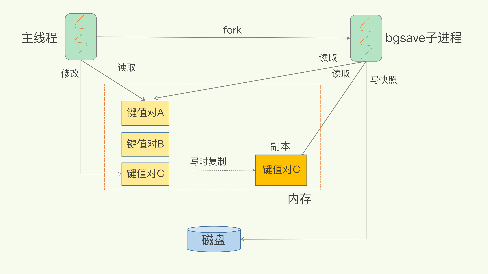
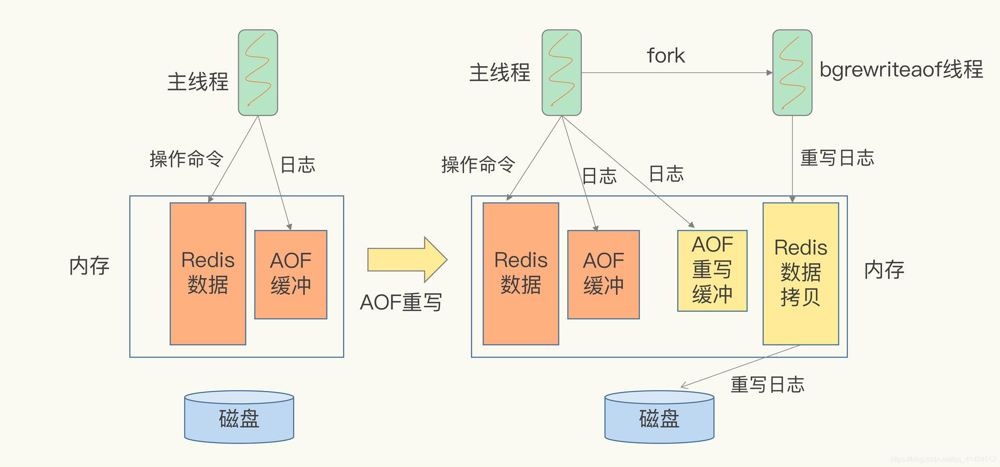

# 问题与简答
## leo总结

## redis用的几个数据结构
这个参考了书籍《redis设计与实现》
### 简单动态字符串 sds
1. 常数复杂度获取字符串长度
2. 杜绝缓冲区溢出
3. 减少修改字符串是带来的内存重分配次数
    - 空间预分配
    - 惰性空间释放
4. 二进制安全（用长度，而不是特殊的字符判断是不是结束）
5. 兼容部分c字符串函数

#### 2.4重点回顾
- redis只会使用c字符串作为字面量，在大多数情况下，redis使用SDS（Simple Dynamic String，简单动态字符串）作为字符串表示。
- 比起C字符串，SDS具有以下优点
  1. 常数复杂度获取字符串长度
  2. 杜绝缓冲区溢出
  3. 减少修改字符串长度时所需的内存重分配次数
  4. 二进制安全
  5. 兼容部分C字符串函数


### 链表
列表键底层实现之一就是链表。当一个列表键包含了数量比较多的元素，又或者列表中包含的元素都是比较长的字符串时，redis就会使用链表作为列表键的底层实现。

Redis的链表实现的特性：
1. 双端
2. 无环
3. 有头指针、尾指针
4. 有链表长度计数器
5. 多态   （节点可以保存不同类型的值）

**重点回顾**
- 链表被广泛用于实现Redis的各种功能，比如列表键、发布与订阅、慢查询、监视器等
- 每个链表节点有一个listNode结构来表示，每个节点都有一个指向前置节点和后置节点的指针，所以Redis的链表实现是双端链表
- 每个链表使用一个list结构来表示，这个结构带有表头节点指针、表位节点指针，以及链表长度等信息
- 因为链表表头节点的前置节点和表尾节点的后置节点都指向NULL，所以Redis的链表实现是无环链表
- 通过为链表设置不同的类型特定函数，Redis的链表可以用于保存各种不同类型的值


### 字典
除了用来表示数据库之外，字典还是哈希键的底层实现之一，当一个哈希键包含的键值对比较多，又或者键值对中的元素都是比较长的字符串时，redis就会使用字典作为哈希键的底层实现。

**4.7重点回顾**
- 字典被广泛用于实现Redis的各种功能，其中包括数据库和哈希键。
- Redis中的字典使用哈希表作为底层实现，每个字典带有两个哈希表，一个平时使用，另一个仅在进行rehash时使用
- 当字典表被用作数据库的底层实现，或者哈希键的底层实现时，Redis使用MurmurHash2算法来计算键的哈希值
- 哈希表使用链地址法（拉链法）来解决键冲突，被分配到同一个索引上的多个键值对会连接成一个单向链表
- 在对哈希表进行扩展或者收缩操作时，程序需要将现有哈希表包含的所有键值对rehash到新哈希表里面，并且这个rehash过程并不是一次性的完成，而是渐进式

### 跳表
有序集合的底层实现之一，如果一个有序结合包含的元素数量较多，又或者有序集合中的元素成员是比较长的字符串时，redis就会使用跳跃表作为有序集合键的底层实现，前两个也都是元素较多，或者有长字符串的时候，挺有意思的。

**5.3重点回顾**
- 跳跃表是有序集合的底层实现之一
- Redis的跳跃表实现有zskiplist和zskiplistNode两个结构组成，其中zskiplist用于保存跳跃表信息（比如表头节点、表尾节点、长度），而zskiplistNode则用于表示跳跃表节点
- 每一个跳跃表的节点的层高都是1-32的随机数
- 在同一个跳跃表中，多个节点可以包含相同的分值，但每个节点的成员对象必须是唯一的
- 跳跃表中的节点按照分值大小进行排序，挡分值相同时，节点按照成员对象的大小进行排序

### 整数集合
是集合键的底层实现之一，当一个集合只包含整数值元素，并且这个集合的元素数量不多时，就用的这个。

**6.6重点回顾**
- 整数集合石集合键的底层实现之一
- 整数集合的底层实现为数组，这个数组一有序、无重复的方式保存集合元素，在有需要时，程序会根据新添加元素的类型，改变这个数组的类型
- 升级操作位整数集合带来了操作上的灵活性，并且尽可能地节约了内存
- 整数集合之支持升级操作，不支持降级操作

### 压缩列表
压缩列表是list和hashtable底层实现之一，当一个list只包含少量列表项，并且每一个列表项要么就是小整数值，要么就是比较短的字符串，那么redis就用压缩列表来做list的底层实现。

同样，如果一个hashtable只包含少量键值对，并且每一个键值对的键和值要么是小整数值，要么是短字符串。

**7.5重点回顾**
- 压缩列表是一种位节约内存而开发的顺序型数据结构
- 压缩列表被用作列表键和哈希键的底层实现之一
- 压缩列表可以包含多个节点，每个节点可以保存一个字节数组或者整数值
- 添加新节点到压缩列表，或者从压缩列表中删除节点，可能会引发连锁更新操作，但这种操作出现的几率并不高


### 数据结构和用
|数据结构|哪些地方用到了|
||-|
|sys简单动态字符串|string|
|链表|列表键  发布与订阅、慢查询、监视器、保存多个客户端的状态信息、使用链表构建客户端输出缓冲区（output buffer）|
|字典|数据库、hashtable、set的底层实现之一|
|跳表|zset底层实现之一|
|整数集合|set的底层实现之一|
|压缩列表|list hashtable|

### 对象和用的底层数据结构
|对象类型|底层数据结构|
|-|-|
|list|压缩列表、双端链表|
|哈希对象|压缩列表、字典|
|集合对象|整数集合、字典|
|zset|压缩列表、跳表|


### rdb aof
https://blog.csdn.net/weixin_43064185/article/details/122035596

http://118.25.23.115/redis/04-AOF%E6%97%A5%E5%BF%97%EF%BC%9A%E5%AE%95%E6%9C%BA%E4%BA%86%EF%BC%8CRedis%E5%A6%82%E4%BD%95%E9%81%BF%E5%85%8D%E6%95%B0%E6%8D%AE%E4%B8%A2%E5%A4%B1%EF%BC%9F.html

### rdb
1. 紧凑的文件
2. 用于灾难恢复
3. 比aof快

手动和自动。

手动分为了同步和异步，自动都是异步的。

主要说一下自动触发，以下四种情况会自动触发。

1. redis.conf中配置save m n，即在m秒内有n次修改时，自动触发bgsave生成rdb文件
2. 主从复制时，从节点要从主节点进行全量复制时也会触发bgsave操作，生成当时的快照发送到从节点
3. 执行debug reload命令重新加载redis时也会触发bgsave操作
4. 默认情况下执行shutdown命令时，如果没有开启aof持久化，那么也会触发bgsave操作
   
redis客户端执行bgsave命令或者自动触发bgsave命令过程：
1. 主进程判断当前是否已经存在正在执行的子进程，如果存在，那么主进程直接返回；
2. 如果不存在正在执行的子进程，那么就fork一个新的子进程进行持久化数据，fork过程是阻塞的，fork操作完成后主进程即可执行其他操作；
3. 子进程先将数据写入到临时的rdb文件中，待快照数据写入完成后再原子替换旧的rdb文件；
4. 同时发送信号给主进程，通知主进程rdb持久化完成，主进程更新相关的统计信息（info Persitence下的rdb_*相关选项）。

#### RDB 更深入理解

> 由于生产环境中我们为Redis开辟的内存区域都比较大（例如6GB），那么将内存中的数据同步到硬盘的过程可能就会持续比较长的时间，而实际情况是这段时间Redis服务一般都会收到数据写操作请求。那么如何保证数据一致性呢？

RDB中的核心思路是OW（Copy On Write）机制，来保证在进行快照操作的这段时间，需要压缩写入磁盘上的数据在内存中不会发生变化。在正常的快照操作中，一方面Redis主进程会fork一个新的快照进程专门来做这个事情，这样保证了Redis服务不会停止对客户端包括写请求在内的任何响应。另一方面这段时间发生的数据变化会以副本的方式存放在另一个新的内存区域，待快照操作结束后才会同步到原来的内存区域。

举个例子：如果主线程对这些数据也都是读操作（例如图中的键值对 A），那么，主线程和 bgsave 子进程相互不影响。但是，如果主线程要修改一块数据（例如图中的键值对 C），那么，这块数据就会被复制一份，生成该数据的副本。然后，bgsave 子进程会把这个副本数据写入 RDB 文件，而在这个过程中，主线程仍然可以直接修改原来的数据。


在进行快照操作的这段时间，如果发生服务崩溃怎么办？

这次就失败了，以上次为准。

可以每秒做一次快照吗？

如果频繁地执行全量快照，也会带来两方面的开销：

1. 一方面，频繁将全量数据写入磁盘，会给磁盘带来很大压力，多个快照竞争有限的磁盘带宽，前一个快照还没有做完，后一个又开始做了，容易造成恶性循环。
2. 另一方面，bgsave 子进程需要通过 fork 操作从主线程创建出来。虽然，子进程在创建后不会再阻塞主线程，但是，fork 这个创建过程本身会阻塞主线程，而且主线程的内存越大，阻塞时间越长。如果频繁 fork 出 bgsave 子进程，这就会频繁阻塞主线程了。
3. 
那么，有什么其他好方法吗？此时，我们可以做增量快照，就是指做了一次全量快照后，后续的快照只对修改的数据进行快照记录，这样可以避免每次全量快照的开销。这个比较好理解。

但是它需要我们使用额外的元数据信息去记录哪些数据被修改了，这会带来额外的空间开销问题。那么，还有什么方法既能利用 RDB 的快速恢复，又能以较小的开销做到尽量少丢数据呢？且看后文中4.0版本中引入的RDB和AOF的混合方式。

- 优点
1. DB文件是某个时间节点的快照，默认使用LZF算法进行压缩，压缩后的文件体积远远小于内存大小，适用于备份、全量复制等场景；
2. Redis加载RDB文件恢复数据要远远快于AOF方式；

- 缺点
1. RDB方式实时性不够，无法做到秒级的持久化；
2. 每次调用bgsave都需要fork子进程，fork子进程属于重量级操作，频繁执行成本较高；
3. RDB文件是二进制的，没有可读性，AOF文件在了解其结构的情况下可以手动修改或者补全；
4. 版本兼容RDB文件问题；

### AOF 持久化
> Redis是“写后”日志，Redis先执行命令，把数据写入内存，然后才记录日志。日志里记录的是Redis收到的每一条命令，这些命令是以文本形式保存。PS: 大多数的数据库采用的是写前日志（WAL），例如MySQL，通过写前日志和两阶段提交，实现数据和逻辑的一致性。

而AOF日志采用写后日志，即先写内存，后写日志。

- 为什么采用写后日志？

Redis要求高性能，采用写日志有两方面好处：

1. 避免额外的检查开销
Redis 在向 AOF 里面记录日志的时候，并不会先去对这些命令进行语法检查。所以，如果先记日志再执行命令的话，日志中就有可能记录了错误的命令，Redis 在使用日志恢复数据时，就可能会出错。
2. 不会阻塞当前的写操作

但这种方式存在潜在风险：

1. 如果命令执行完成，写日志之前宕机了，会丢失数据。
2. 主线程写磁盘压力大，导致写盘慢，阻塞后续操作。

如何实现AOF
AOF日志记录Redis的每个写命令，步骤分为：命令追加（append）、文件写入（write）和文件同步（sync）。

命令追加 当AOF持久化功能打开了，服务器在执行完一个写命令之后，会以协议格式将被执行的写命令追加到服务器的 aof_buf 缓冲区。

文件写入和同步 关于何时将 aof_buf 缓冲区的内容写入AOF文件中，Redis提供了三种写回策略：


为了提高文件写入效率，在现代操作系统中，当用户调用write函数，将一些数据写入文件时，操作系统通常会将数据暂存到一个内存缓冲区里，当缓冲区的空间被填满或超过了指定时限后，才真正将缓冲区的数据写入到磁盘里。
 
这样的操作虽然提高了效率，但也为数据写入带来了安全问题：如果计算机停机，内存缓冲区中的数据会丢失。为此，系统提供了fsync、fdatasync同步函数，可以强制操作系统立刻将缓冲区中的数据写入到硬盘里，从而确保写入数据的安全性。

#### 深入理解AOF重写
> AOF会记录每个写命令到AOF文件，随着时间越来越长，AOF文件会变得越来越大。如果不加以控制，会对Redis服务器，甚至对操作系统造成影响，而且AOF文件越大，数据恢复也越慢。为了解决AOF文件体积膨胀的问题，Redis提供AOF文件重写机制来对AOF文件进行“瘦身”。

Redis通过创建一个新的AOF文件来替换现有的AOF，新旧两个AOF文件保存的数据相同，但新AOF文件没有了冗余命令。

AOF重写会阻塞吗？

AOF重写过程是由后台进程bgrewriteaof来完成的。主线程fork出后台的bgrewriteaof子进程，fork会把主线程的内存拷贝一份给bgrewriteaof子进程，这里面就包含了数据库的最新数据。然后，bgrewriteaof子进程就可以在不影响主线程的情况下，逐一把拷贝的数据写成操作，记入重写日志。

所以aof在重写时，在fork进程时是会阻塞住主线程的。

重写日志时，有新数据写入咋整？
重写过程总结为：“一个拷贝，两处日志”。在fork出子进程时的拷贝，以及在重写时，如果有新数据写入，主线程就会将命令记录到两个aof日志内存缓冲区中。如果AOF写回策略配置的是always，则直接将命令写回旧的日志文件，并且保存一份命令至AOF重写缓冲区，这些操作对新的日志文件是不存在影响的。（旧的日志文件：主线程使用的日志文件，新的日志文件：bgrewriteaof进程使用的日志文件）

而在bgrewriteaof子进程完成会日志文件的重写操作后，会提示主线程已经完成重写操作，主线程会将AOF重写缓冲中的命令追加到新的日志文件后面。这时候在高并发的情况下，AOF重写缓冲区积累可能会很大，这样就会造成阻塞，Redis后来通过Linux管道技术让aof重写期间就能同时进行回放，这样aof重写结束后只需回放少量剩余的数据即可。

最后通过修改文件名的方式，保证文件切换的原子性。

在AOF重写日志期间发生宕机的话，因为日志文件还没切换，所以恢复数据时，用的还是旧的日志文件。

总结操作：

主线程fork出子进程重写aof日志
子进程重写日志完成后，主线程追加aof日志缓冲
替换日志文件
温馨提示

这里的进程和线程的概念有点混乱。因为后台的bgreweiteaof进程就只有一个线程在操作，而主线程是Redis的操作进程，也是单独一个线程。这里想表达的是Redis主进程在fork出一个后台进程之后，后台进程的操作和主进程是没有任何关联的，也不会阻塞主线程。


- 在重写日志整个过程时，主线程有哪些地方会被阻塞？
1. fork子进程时，需要拷贝虚拟页表，会对主线程阻塞。
2. 主进程有bigkey写入时，操作系统会创建页面的副本，并拷贝原有的数据，会对主线程阻塞。
3. 子进程重写日志完成后，主进程追加aof重写缓冲区时可能会对主线程阻塞。

- 为什么AOF重写不复用原AOF日志？
1. 父子进程写同一个文件会产生竞争问题，影响父进程的性能。
2. 如果AOF重写过程中失败了，相当于污染了原本的AOF文件，无法做恢复数据使用。

### RDB和AOF混合方式（4.0版本)
> Redis 4.0 中提出了一个混合使用 AOF 日志和内存快照的方法。简单来说，内存快照以一定的频率执行，在两次快照之间，使用 AOF 日志记录这期间的所有命令操作。

在该模式下，AOF 重写产生的文件将同时包含 RDB 格式的内容和 AOF 格式的内容，该文件的前半段是 RDB 格式的全量数据，而后半段是 Redis 命令格式的增量数据

1. RDB 做全量持久化，AOF 做增量持久化
2. 由于 RDB 是间隔一段时间后才会进行持久化，在此期间内如果 Redis 服务出现问题，则会丢失这一段时间内的数据，因此需要 AOF 来配合使用
3. 在 Redis 重启时，会使用 BGSAVE 命令生成的 RDB 文件来重新构建内容，再使用 AOF 来重新执行近期的写指令，来实现数据的完整恢复

Redis主从同步
1. 增量同步：Redis主节点会将自己存储在Buffer中的操作指令异步同步给从库，从节点收到同步成功指令后会像主节点上报自己同步到文件偏移量。因为Redis主库的Buffer使用的是环形数组数据存储结构，如果Buffer满了会从数组的头部开始覆盖写入，如果主从延迟过大，就会存在Buffer中的写入速度大于同步速度而导致指令丢失的可能。
2. 快照同步：为了解决增量同步主从延迟数据丢失的问题引入了快照同步方式，这个过程较消耗性能。当发现增量同步有丢失数据的风险时，主库会fork一个子进程对主库做一次当前内存快照备份发送给从库。从节点接收到主库的RDB备份后，释放掉当前所有的数据，让回放RDB文件。回放完成后通知主库再进行增量同步。在整个快照过程中主节点的Buffer还在不停的前移，如果复制回放rdb文件的时间比Buffer前移的更慢的话，就会导致在RDB同步的过程中Buffer中未同步的指令又被覆盖则rdb同步失败，这样就会导致主库再次进入快照过程中，将新的Rdb文件同步给从库。这样就陷入一个死循环中，我们在平时设计中要考虑到主从延迟导致的Buffer堆积空间大小，给定一个包含网络延迟导致的Buffer堆积的合理大小，做到不低估，不浪费。
3. 无盘复制：我上面说到过一般为了提升主节点性能我们会将日志文件刷盘的操作交给从库来操作。所谓无盘复制就是主节点通过Socket将快照发生到从节点，主节点一边遍历内存一边发送RDB文件内容，从节点将收到的完整的RDB文件存储到磁盘，再进行回放。
4. 同步复制：Redis的主从复制大部分都是异步的，想要保证数据的强一致性，我们可以使用Redis提供的wait指令进行同步复制，假如将wait的等待时间设置为无限等待从库同步完成，那么当网络发生分区或者延迟较高的时候，就出现严重阻塞，影响Redis的可用性。
过期key的的主从同步：需要注意的一点是在中从同步过程中对于过期key处理是不同的。有一条中原则就是：过期key统一由主节点删除。主节点在删除一条key时会显示的向所有从节点发送一条del指令，从节点在自己的内存遇到过期key时只需要向客户端返回过期，不做删除动作，等待主节点同步del来删除。


### Redis Sentinel 哨兵模式解决主节点挂的问题
上面讲到的主从架构，当发生主节点宕机，只能通过手工切换的方式来恢复故障，往往反映速度都是视情况而定的，一旦造成损失那将是巨大的。所以Redis就引入了哨兵架构模式的自动故障恢复，这样也同样因为引入新的组件导致系统复杂度跟着上升。首先Redis哨兵服务也需要单独部署，保证高可用。所以还需要引入分布式协调组件例如zookeeper等，这样就能保证Redis哨兵始终能够感知到Redis集群的状态，当然也就存在所有分布式架构存在问题。Redis哨兵负责监控主节点的健康，当主节点不可用时，会自动选择一个从节点切换为主节点（这里怎么选择从节点的问题就不展开说明了）。客户端在请求主节点时访问失败会通过Redis哨兵查询主节点的地址，成功后再将新的主节点列表缓存到客户端中。等故障主节点恢复后会作为一个新的只读从节点加入集群。这个只读状态很重要，如果是用户主动采取主从切换到的话，客户端从本地缓存中访问老的主库时会抛出ReadonlyErr异常，就会触发客户拉去新的主节点列表。以上除了引入哨兵的服务其他与主从架构如出一辙。我们下面来讲一下讲求性能的提示而演变的架构


RedisCluster
在上面解决了集群的健壮性后，那么随之探索的就是数据的存储的性能上，在集群模式下都是通过全量数据冗余来保证数据的一致性与可用性，在空间上造成了巨大的浪费。这一节我们将介绍Redis的分布式集群存储方式RedisCluster，它的单个节点上不在是全量数据，而只含有整个集群的一份数据。这样既改善了存储空间浪费的问题，同时也增横向增加了Redis服务整体的吞吐性。RedisCluster将所有数据存储区域划分为16384个slots（槽位），每个节点负责一部分槽位，槽位的信息存储于每个节点中。当客户端请求进来时候会拉去一份槽位信息列表缓存在本地，RedisCluster的每个节点会将集群的配置信息持久化到自己的配置文件中，所以需要引入一套可维护的配置文件管理方案，尽量做到自动化。

槽位算法：RedisCluster 默认会根据key使用crc32算法进行hash得到一个整数，然后用这个整数对16384取模定位key所在的槽位。它还运行用户在key字符串里面嵌入tag将key强制写入指定的槽位。

迁移：当有新的节点加入或者断开节点时，就会触发Redis槽位迁移。当一个槽位正在迁移时候在原节点的状态为migrating，在目标节点的状态为importing。原节点的单个key执行dump指令得到序列化内容，再向目标节点发送restore携带序列化内容作为参数的指令，目标节点接收到内容后反序列化复制到内存中，响应给原节点成功。原节点收到成功响应后把当前节点的key删掉就完成了节点数据迁移。这个过程是一个同步的操作，在复制完成之前原节点时处于阻塞状态的，不会进入新的数据，直到原节点的key被删除完成。如果key内容过大就会导致迁移阻塞时间过长，出现卡顿现象，所以再次强调大key的危害。上面说完了在迁移过程中服务端的变化，现在我们来说一下槽位迁移对于客户端的变化：这时候新旧节点会同时存在部分key，客户端访问到旧节点，如果旧节点存在就正常处理返回。如果客户端访问的数据不在旧节点，它会向客户端发生一个重定向指令（-ASK targetNodeAddr），客户端收到重定向后，先去目标节点执行一个不带参数的asking指令，然后在目标节点执行操作。因为在没有完全迁移完槽位目标节点还不归新节点管理，如果只适合直接发生操作指令，目标节点会返回给客户端一个-MOVED重定向指令，让它去原节点执行，这样就出现了重定向循环。不带参的asking指令目的就是打开目标节点选项让它当做自己的槽位的请求来处理。通过上面的过程得知在迁移过程中，平时的一个指令需要三个ttl才能完成。

跳转：当RedisCluster发生槽位变化的数据迁移时，这时候客户端保存的槽位信息就和RedisCluster的槽位信息不一致，当客户端访问到错误的槽位时候，当前槽位会相应给客户端一个可能包含此数据的槽位信息，当客户端访问成功后更新本地槽位信息。

容错：RedisCluster为每个主节点设置了若干从节点，主节点故障时，集群会主动提升某个从节点作为主节点，当无主节点时Redis整个不可用。也可以通过 cluster-require-full-coverage参数设置允许部分节点故障，其他节点依然可以对完提供服务。实际在异常无处不在生成环境中突然部分节点变得不可用，间隔一会又突然好了是很常见的时候，为了解决这问题我们也通过设置容忍最大离线时间（cluster-node-timeout）来避免，当超过这个最大超时时间则认为节点不可用。还有一个作为被乘数系数来放大超时时间的参数：cluster-slave-validity-factor，当值为0的时候是不能容忍异常短暂离线，系数越大相对越宽松。RedisCluster作为一个去中心化的中间件，一个节点认为某个节点离线，叫可能离线，当所有或者当大多数节点认为某节点离线才叫真正离线，此时集群会剔除此节点或者触发主从切换。它是用Gossip协议来广播自己的状态以及对整个集群变化的感知。比如一个节点发现某节点离线，它会将这个信息向整个集群广播，其他节点也会受到这个信息，如果收到信息的节点发现目标节点状态正常则不更新这条信息，并发送目标节点正常的消息给整个集群，就这样一个个节点的传播消息。当整个集群半数以上节点都持有某目标节点已离线的的信息时候才认为，某目标节点离线的这一事实，否则不予处理。

### 分布式
用一个机器纵向扩展，当数据量很大的时候，rdb fork子进程的时间会很长，阻塞主进程。

数据切片后，在多个实例之间如何分布？客户端怎么确定想要访问的数据在哪个实例上？

数据切片和实例的对应分布关系

### 并发解决 原子性 & 加锁
https://juejin.cn/post/7028202018338504734

在使用Redis时不可避免地会遇到并发访问的问题，比如多个用户同时下单，就会对缓存中的商品库存数据进行并发更新。一旦有了并发写操作，数据就会被修改，如果没有做好并发控制，就会导致数据被修改错误，影响到业务的正常使用。（例如秒杀场景下的超卖情况）

​	为了保证并发访问的正确性，Redis提供了两个方法，分别是加锁和原子操作。

​	原子操作是指执行过程中保持原子性的操作，而且原子操作执行时并不需要再加锁，实现了无锁操作。这样既保证了并发控制，还能减少对系统并发性能的影响。

​	Redis加锁会有两个问题，一方面是加锁操作多，会降低系统的并发访问性能。另一方面Redis客户端加锁时，需要用到分布式锁，而这需要额外的存储系统来提供加解锁的操作。

#### 原子操作
​	并发控制针对的操作范围主要是数据修改操作。当有多个客户端对同一份数据执行RMW（Read-Modify-Write）操作时，我们就需要RMW操作涉及的代码以原子性方式执行。访问同一份数据的RMW操作代码，就叫做临界区代码。RMW操作即是指客户端要对数据做修改操作时所需要执行的步骤，即要先读取Redis中的内存数据到客户端中，然后在本地修改，最后写入到Redis服务中。而这部分操作就是指临界区的操作逻辑了。

Redis 的两种原子操作方法

​	为了实现并发控制要求的临界区代码互斥执行。Redis的原子操作采用了两种方法：

1. 单命令操作 把多个操作在Redis中实现一个操作，也就是单命令操作；
2. Lua脚本 把多个操作写到一个Lua脚本中，以原子性方式执行单个。

- 单命令操作
 
​	虽然Redis的单个命令可以原子性执行，但实际操作中数据修改包含了多个命令的操作，包括数据读取、数据增减、写回数据三个操作。

​	这种情况就需要使用Redis提供的单命令操作了。例如INCR/DECR命令就可以实现数据的增减操作，而且因为它们本身就是单个命令操作，所以在执行它们时，就保证了它们的互斥性。

- Lua脚本
​
如果只是简单的增减操作，那么就可以使用单命令保证其原子性了。但是可能会有更复杂的判断逻辑或者其它操作，那么就需要过封装多个命令在Lua脚本执行操作了。

​	Redis 会把整个 Lua 脚本作为一个整体执行，在执行的过程中不会被其他命令打断，从而保证了 Lua 脚本中操作的原子性。但是如果把很多操作都放在 Lua 脚本中原子执行，会导致 Redis 执行脚本的时间增加，同样也会降低 Redis 的并发性能。所以在编写Lua脚本时需要避免把不需要做并发控制的操作写入脚本中。

- 分布式加锁

在应对并发问题时，除了原子操作，Redis客户端可采用加锁的方法，来控制并发写操作对共享数据的修改，从而保证数据的正确性。

​	当有多个客户端需要争抢锁时，需要保证的是这把锁不能是某个客户端本地的锁。否则的话，其它客户端的是无法访问到这把锁的，更不要说是获取锁了。所以在分布式系统中，当有多个客户端需要获取锁时，需要使用分布式锁。此时锁是保存在共享存储系统中的，可以被多个客户端共享访问和获取。

​	而Redis正好可以被多个客户端共享访问，可以保存分布式锁。

加锁操作和释放锁的操作就是针对锁的键值进行读取、判断、设置的过程。

加锁时根据锁变量值判断是否可以加锁，如果可以则对锁变量值进行修改，表示持有锁；

释放锁时同样需要进行判断，因为需要判断当前加锁的是不是该客户端，如果不判断直接释放锁的话，会被其它客户端将持有的锁给释放掉了；如果可以释放锁，则重置锁变量的值；

这样一来，因为加锁释放锁涉及了多个操作，所以实现分布式锁时需要两个保证：

1. 锁操作的原子性；
2. 分布式锁的可靠性；

锁操作的原子性

锁操作的原子性可以采用上面提到的单命令操作和Lua脚本操作。

单命令操作和Lua脚本

使用 SETNX 和 DEL命令即可实现加锁和释放锁的操作。SETNX命令表示在执行时会判断键值对是否存在，如果不存在，就设置键值对的值，如果存在，就不做任何设置。

SETNX key value

释放锁时直接将锁删除掉即可。

但进行操作时需要注意两个问题：

一是锁的过期时间设置；在加锁后，如果后面的逻辑发生了异常导致没有释放锁，这时就需要过期时间去保证该客户端不能一直持有锁。

还有一个是需要区别不同客户端的释放锁操作；这可以让每个客户端加锁时设置唯一值；

锁过期时间的设置和释放锁的操作都需要保证原子性；这里使用SET命令的NX选项 和Lua脚本保证了。

SET KEY VALUE [EX seconds | PX milliseconds] [NX]

即SET lock_key unique_value NX PX 10000 表示给lock_key这个键设置unique_value值，同时设置过期时间为10000ms。

释放锁也包含了读取锁变量值、判断锁变量值和删除锁变量三个操作，不过，我们无法使用单个命令来实现，所以，我们可以采用 Lua 脚本执行释放锁操作，通过 Redis 原子性地执行 Lua 脚本，来保证释放锁操作的原子性。

释放锁时的Lua脚本：
```
//释放锁 比较unique_value是否相等，避免误释放
if redis.call("get",KEYS[1]) == ARGV[1] then
    return redis.call("del",KEYS[1])
else
    return 0
end
// 复制代码
redis-cli  --eval  unlock.script lock_key , unique_value 
```

- 分布式锁的可靠性

为了避免锁实例出现故障而导致的锁无法工作的问题，需要按照一定的步骤和规定。Redis 的开发者 Antirez 提出了分布式锁算法 Redlock。

RedLock的基本思路是，是让客户端和多个独立的Redis实例依次请求加锁，如果客户端能够与半数以上的实例成功地完成加锁操作，那么就认为客户端获得了分布式锁。这样一来，即使有某个Redis实例发生故障，那么也有其它实例可以做锁操作的支撑。
RedLock算法实现的可以分为3个步骤，假设需要有N个独立的Redis实例：

客户端获取当前时间；

客户端按顺序依次向N个Redis实例执行加锁操作；

向Redis实例请求加锁，一样是采用SET NX 原子操作的命令，为了保障在加锁过程中Redis故障了，需要给加锁操作设置一个超时时间。如果超时了，那么会去下一个Redis实例继续请求加锁。

加锁操作的超时时间需要远远小于锁的有效时间，一般也是设置几十毫秒。


一旦客户端完成了和所有Redis实例的加锁操作，客户端计算整个加锁过程的总耗时。

客户端需要满足以下两个条件才能认为是加锁成功：

客户端从超过半数（大于等于N/2 + 1)的Redis实例上成功获取到了锁；

客户端获取锁的总耗时没有超过锁的有效时间。


在满足加锁成功的条件后，需要重新计算锁的有效时间，计算结果是锁的最初有效时间减去客户端为获取锁的总耗时。如果锁的有效时间已经来不及完成共享数据的操作了，那么就需要释放锁，以免出现还没完成数据操作，锁就过期的情况。


### Redis - 为何redis集群用哈希槽，而不用一致性哈希？
1. Hash slot(slot 空间)对比一致性哈希(环空间) 可以做到数据分配更均匀 
有 N 个节点,每个节点是准确的承担 1/N 的容量
一致性哈希，它使用的是hash函数返回的值是随机的。
2. Hash slot 更便捷的新增/删除节点
假设已有R1、R2、R3 节点

若新增 R4 节点，只需要从 R1、R2、R3 挪一部分 slot 到 R4 上

若删除 R1  节点，只需将 R1 中 slot 移到 R2 和 R3 节点上, 节点之间的槽移动不会停止服务，集群是一直可用状态。
3. 当一致性哈希增删节点时，会导致部分数据无法命中，严重的甚至会导致缓存雪崩。


### redis6.0多线程

https://blog.csdn.net/qq_30192655/article/details/121771343

https://blog.csdn.net/ldw201510803006/article/details/124790121

 总结：
 Redis基于Reactor模式开发了网络事件处理器。

当有客户端连接请求时，主线程接收并解析请求，然后执行命令处理请求，最后把结果返回给客户端。这个流程都是主线程在处理，所以在 redis6.0 以前都是单线程的。

对于 redis 性能来讲，其性能不在 cpu，而在于内存和网络。redis 的存在就是为了做缓存，因此系统搭建采用 redis 的话，一般内存是足够的，若不够，可以加大内存或者优化数据结构能方式进行优化。因此，网络优化对于 redis来讲才是大头。

本次 redis 采用多线程，主要解决的就是网络 IO 部分, 处理网络数据的读写和协议的解析， 对于命令的执行依然是主线程在执行。


#### 第二篇系统的介绍 单线程 - 单线程加后台线程 - 多线程加后台线程
一般来说，一个 redis 请求有两大模块，网络模块 + 命令处理模块。我们常说的 redis 单线程模型，其实主要就指的是一个正常请求涉及的网络模块和命令处理模块。

当执行一个特别慢的命令时，比如删除一个百万级的字典，可能会造成暂时的卡顿，导致 QPS 骤降；基于此，在 redis 4.0 出现专门处理这种 Lazy Free 模型的后台线程。

另外，正常情况下，redis 单线程模型中，网络模块往往成为瓶颈高发地；因此，redis 6.0 引入多线程模型，解决网络模块的问题。

前面系列文章已经介绍了 redis 的单线程模型及其背后的后台线程，因此，本文主要焦点集中在 redis 6.0 出现的多线程。

在开始阅读之前，你也可以思考一个问题：命令处理为什么不采用多线程模型？

一、架构演进？

复杂架构都是逐渐演进而来，从单线程到多线程，从单体功能到复杂功能等等，redis 也是如此。

redis 单线程情况下，也能达到极高的吞吐量，但某些情况下，会出现相当耗时的操作，导致吞处理骤降，因此逐渐引入后台线程来完成这些操作。

慢慢地，当我们要求更高的吞吐量时，网络模块却经常掉链子，在 redis 6.0 中又引入多线程来解决这个问题 ----- 这也是本文主要探讨的问题。

话不多说，开始吧～

1. 单线程

redis 是单线程模式 ------- 这是我们经常听到了说法，仅靠一个线程就能达到几万QPS，简直令人称奇！

我画了张单线程模型图，大概是这样：


你可以直观的看到，redis 确实仅靠一个线程处理了所有客户端的请求，一条龙服务！！！

从接收新连接、IO就绪监听、IO读，到命令执行，最后到命令执行后的数据回复（IO写）等都是一个线程处理，这些操作的封装，redis 中称之为文件事件；

当然，还有。redis 中的另一大事件 ------- 时间事件，负责相关的周期性处理任务，比如 key 过期清理、字典 rehash、触发 AOF 重写/RDB 的 bgsave等等。

值得注意的是，文件事件 和 时间事件 都是由主线程来驱动完成的。入口是 aeMain() 方法，redis 服务启动后，将会一直在此方法中轮训监听事件。

到这，你可能会说，一个线程做这么多事还不得累死？

是的，一个线程串行做这么多事情确实存在很大风险，对于一些耗时长的操作，可能严重拖垮 redis 吞吐量，所以，redis 又搞了一些后台线程来专门处理这些耗时操作。

2. 单线程+后台线程
特别需要注意的是！！！我们经常听说的 redis 单线程模型（上图），其实仅仅指的是对客户端的请求处理，但其实，还有一些工作由对应特殊的线程来完成。

在 redis 6.0 以前，完整的 redis 线程模型是 主线程（1个）+ 后台线程（三个），我画了一张图，你可以看下：

三个后台线程分别处理：

- close_file：关闭 AOF、RDB 等过程中产生的大临时文件
- aof_fsync：将追加至 AOF 文件的数据刷盘（一般情况下 write 调用之后，数据被写入内核缓冲区，通过 fsync 调用才将内核缓冲区的数据写入磁盘）
- lazy_free：惰性释放大对象

这三个线程有一个共同特点，都是用来处理耗时长的操作，也印证了我们常说的，专业的人做专业的事。

3. 多线程+后台线程

咱们继续将时钟往后拨到 redis6.0 版本，此版本出现了一种新的 IO 线程 ---- 多线程。我同样也画了张图，你可以看下：

我们先思考下，引进 IO 线程解决了哪些问题？

在之前系列文章中，我们提到过，通常情况下，redis 性能在于网络和内存，而不是 CPU。针对 网络，一般是处理速度较慢的问题；针对内存，一般是指物理空间的限制。

所以到这，你应该很清楚了，究竟哪个模块需要引入多线程来处理？

没错，就是网络模块，因此，引入的这些线程也叫 IO线程；由于主线程也会处理网络模块的工作，因此，主线程习惯上也叫做主IO线程。

网络模块有接收连接、IO读（包括数据解析）、IO写等操作；其中，主线程负责接收新连接，然后分发到 IO线程进行处理（主线程也参与）。我画了张图，你可以看下：


二、原理

前面我们已经讲到，redis 6.0 出现的多线程主要致力于解决网络模块的瓶颈，通过使用多线程处理读/写客户端数据，进而分担主IO线程的压力。

值得注意的是，命令处理仍然是单线程执行。

为了更好的帮助你理解，我们再来回顾下，请求处理流程：


#### CPU 4 核以上，才考虑开启多线程，其中：

- 4 核开启 2 - 3 个 IO 线程
- 8 核 开启 6 个 IO 线程
- 超过 8 个 IO 线程，性能提升已经不大
- 值得注意的是，以上的 IO 线程其实包含了主 IO 线程。


本文从 redis 架构演进开始讲起，从单线程模型 => 单线程 + 后台线程 => 多线程 + 后台线程 演进。

每一次演进，都是为了解决某一类特殊问题；后台线程的出现，解决了一些耗时长的重操作。同样，多线程的出现，解决了网络模块的性能瓶颈。

回到开篇问题：为什么命令执行为什么不采用多线程？
1. 使用多线程会提升复杂度，对于 redis 这种内存数据库，代价太高
2. 一般情况下，redis 的瓶颈在于网络模块和内存，而非 CPU
3. 可以在一台机器上部署多个实例（集群模式）
4. 复杂（慢）命令可以通过 redis module 解决


### redis 为什么用单线程，并且还那么快

#### 为什么要用单线程

#### 为什么快
总结一下就是：
1. Redis 的大部分操作在内存上完成
2. 采用了高效的数据结构  例如哈希表和跳表，这是它实现高性能的一个重要原因
3.  Redis 采用了多路复用机制， 使其在网络 IO 操作中能并发处理大量的客户端请求，实现高吞吐率

#### Redis 为什么用单线程？
1. 多线程并发访问控制难题
2. 采用多线程一半会引入同步原语来保护共享资源的并发访问，降低了代码的易调试性和可维护性


leo：与单线程对应的就是多线程，多线程编程模式面临的共享资源的并发访问控制问题，系统中通常会存在被多线程同时访问的共享资源，比如一个共享的数据结构。

并发访问控制一直是多线程开发中的一个难点问题，如果没有精细的设计，比如说，只是简单地采用一个粗粒度互斥锁，就会出现不理想的结果：即使增加了线程，大部分线程也在等待获取访问共享资源的互斥锁，并行变串行，系统吞吐率并没有随着线程的增加而增加。

而且，采用多线程开发一般会引入同步原语来保护共享资源的并发访问，这也会降低系统代码的易调试性和可维护性。为了避免这些问题，Redis 直接采用了单线程模式。


首先，我要和你厘清一个事实，我们通常说，Redis 是单线程，主要是指 Redis 的网络 IO 和键值对读写是由一个线程来完成的，这也是 Redis 对外提供键值存储服务的主要流程。但 Redis 的其他功能，比如持久化、异步删除、集群数据同步等，其实是由额外的线程执行的。

要弄明白这个问题，我们就要深入地学习下 Redis 的单线程设计机制以及多路复用机制。之后你在调优 Redis 性能时，也能更有针对性地避免会导致 Redis 单线程阻塞的操作，例如执行复杂度高的命令。


日常写程序时，我们经常会听到一种说法：“使用多线程，可以增加系统吞吐率，或是可以增加系统扩展性。”的确，对于一个多线程的系统来说，在有合理的资源分配的情况下，可以增加系统中处理请求操作的资源实体，进而提升系统能够同时处理的请求数，即吞吐率。下面的左图是我们采用多线程时所期待的结果。

但是，请你注意，通常情况下，在我们采用多线程后，如果没有良好的系统设计，实际得到的结果，其实是右图所展示的那样。我们刚开始增加线程数时，系统吞吐率会增加，但是，再进一步增加线程时，系统吞吐率就增长迟缓了，有时甚至还会出现下降的情况。

为什么会出现这种情况呢？一个关键的瓶颈在于，系统中通常会存在被多线程同时访问的共享资源，比如一个共享的数据结构。当有多个线程要修改这个共享资源时，为了保证共享资源的正确性，就需要有额外的机制进行保证，而这个额外的机制，就会带来额外的开销。

拿 Redis 来说，在上节课中，我提到过，Redis 有 List 的数据类型，并提供出队（LPOP）和入队（LPUSH）操作。假设 Redis 采用多线程设计，如下图所示，现在有两个线程 A 和 B，线程 A 对一个 List 做 LPUSH 操作，并对队列长度加 1。同时，线程 B 对该 List 执行 LPOP 操作，并对队列长度减 1。为了保证队列长度的正确性，Redis 需要让线程 A 和 B 的 LPUSH 和 LPOP 串行执行，这样一来，Redis 可以无误地记录它们对 List 长度的修改。否则，我们可能就会得到错误的长度结果。这就是多线程编程模式面临的共享资源的并发访问控制问题。

并发访问控制一直是多线程开发中的一个难点问题，如果没有精细的设计，比如说，只是简单地采用一个粗粒度互斥锁，就会出现不理想的结果：即使增加了线程，大部分线程也在等待获取访问共享资源的互斥锁，并行变串行，系统吞吐率并没有随着线程的增加而增加。

而且，采用多线程开发一般会引入同步原语来保护共享资源的并发访问，这也会降低系统代码的易调试性和可维护性。为了避免这些问题，Redis 直接采用了单线程模式。

讲到这里，你应该已经明白了“Redis 为什么用单线程”，那么，接下来，我们就来看看，为什么单线程 Redis 能获得高性能。

单线程 Redis 为什么那么快？ 
其实这里是两个问题：
1. 为什么用单线程
2. 为什么那么快？

通常来说，单线程的处理能力要比多线程差很多，但是 Redis 却能使用单线程模型达到每秒数十万级别的处理能力，这是为什么呢？其实，这是 Redis 多方面设计选择的一个综合结果。

总结一下就是：
1. Redis 的大部分操作在内存上完成
2. 采用了高效的数据结构  例如哈希表和跳表，这是它实现高性能的一个重要原因
3.  Redis 采用了多路复用机制， 使其在网络 IO 操作中能并发处理大量的客户端请求，实现高吞吐率

一方面，Redis 的大部分操作在内存上完成，再加上它采用了高效的数据结构，例如哈希表和跳表，这是它实现高性能的一个重要原因。另一方面，就是 Redis 采用了多路复用机制，使其在网络 IO 操作中能并发处理大量的客户端请求，实现高吞吐率。接下来，我们就重点学习下多路复用机制。


### 网络io模型
内核2.4之前用的是poll和select，每次把一百万链接都给系统内核，让他去判断，所以比较慢。

后来是epoll，也是nginx可以处理百万链接的原因。

[redis I/O多路复用（select，poll，epoll）](https://blog.csdn.net/weixin_37518151/article/details/123486259)

[select、poll、epoll详解](https://blog.csdn.net/fengyuyeguirenenen/article/details/124234675)
《深入理解ningx》中有epoll的介绍

IO读写基本原理

> 用户程序进行IO操作实际依赖于linux系统内核read()、write()函数
> read()函数的调用并不是直接从网卡把数据读取到用户内存中，而是把内核缓冲区中的数据复制到用户缓冲区中
> write()函数的调用也并不是直接把数据写入网卡中，而是把用户缓冲区的数据写入到内核缓冲区中
> 网卡与内核缓冲区数据的读写则是由操作系统内核完成


阻塞IO和非阻塞IO
阻塞io是每一个启动一个线程，阻塞执行。

#### 同步阻塞IO
读取数据流程

1. 用户进程调用read()系统函数，用户进程进入阻塞状态
2. 系统内核收到read()系统调用，网卡开始准备接收数据，在一开始内核缓冲区数据为空，内核在等待接收数据，用户进程同步阻塞等待
3. 内核缓冲区中有完整的数据后，内核会将内核缓冲区中的数据复制到用户缓冲区
4. 直到用户缓冲区中有数据，用户进程才能解除阻塞状态继续执行

优点：
1. 开发简单，由于accept()、recv()都是阻塞的，为了服务于多个客户端请求，新的连接创建一个线程去处理即可
2. 阻塞的时候，线程挂起，不消耗CPU资源

缺点：
1. 每新来一个IO请求，都需要新建一个线程对应，高并发下系统开销大，多线程上下文切换频繁
2. 创建线程太多，内存消耗大

同步阻塞IO缺点带来的思考
> 因为accept()、recv()函数都是阻塞的，如果系统想要支持多个IO请求，就创建更多的线程，如果去解决这个问题呢？
> 如果可以把accept、recv函数变成非阻塞的方式，是不是就可以避免创建多个线程了？这就引入了我们的同步非阻塞IO

#### 同步非阻塞IO

读取数据流程
1. 用户进程发起请求调用read()函数，系统内核收到read()系统调用，网卡开始准备接收数据
2. 内核缓冲区数据没有准备好，请求立即返回，用户进程不断的重试查询内核缓冲区数据有没有准备好
3. 当内核缓冲区数据准备好了之后，用户进程阻塞，内核开始将内核缓冲区数据复制到用户缓冲区
4. 复制完成后，用户进程解除阻塞，读取数据继续执行

优点：
1. 非阻塞， accept()、recv()均不阻塞，用户线程立即返回
2. 规避了同步阻塞模式的多线程问题

缺点：
1. 假如现在有1万个客户端连接，但只有1个客户端发送数据过来，为了获取这个1个客户端发送的消息，我需要循环向内核发送1万遍recv()系统调用，而这其中有9999次是无效的请求，浪费CPU资源

同步非阻塞IO缺点带来的思考
> 针对同步非阻塞IO的缺点，设想如果内核提供一个方法，可以一次性把1万个客户端socket连接传入，在内核中去遍历，如果没有数据这个方法就一直阻塞，一但有数据这个方法解除阻塞并把所有有数据的socket返回，把这个遍历的过程交给内核去处理，是不是就可以避免空跑，避免1万次用户态到内核态的切换呢？

什么是IO多路复用？
> 一个线程监测多个IO操作

IO多路复用实现原理
> IO多路复用模型是建立在内核提供的多路分离函数select基础之上的，使用select函数可以避免同步非阻塞IO模型中轮询等待的问题，即一次性将N个客户端socket连接传入内核然后阻塞，交由内核去轮询，当某一个或多个socket连接有事件发生时，解除阻塞并返回事件列表，用户进程在循环遍历处理有事件的socket连接。这样就避免了多次调用recv()系统调用，避免了用户态到内核态的切换。

### IO多路复用的三种实现
#### select
> select函数仅仅知道有几个I/O事件发生了，但并不知道具体是哪几个socket连接有I/O事件，还需要轮询去查找，时间复杂度为O(n)，处理的请求数越多，所消耗的时间越长。

select函数执行流程

1. 从用户空间拷贝fd_set（注册的事件集合）到内核空间
2. 遍历所有fd文件，并将当前进程挂到每个fd的等待队列中，当某个fd文件设备收到消息后，会唤醒设备等待队列上睡眠的进程，那么当前进程就会被唤醒
3. 如果遍历完所有的fd没有I/O事件，则当前进程进入睡眠，当有某个fd文件有I/O事件或当前进程睡眠超时后，当前进程重新唤醒再次遍历所有fd文件
   
select函数的缺点
1. 单个进程所打开的FD是有限制的，通过 FD_SETSIZE 设置，默认1024
2. 每次调用 select，都需要把 fd 集合从用户态拷贝到内核态，这个开销在 fd 很多时会很大
3. 每次调用select都需要将进程加入到所有监视socket的等待队列，每次唤醒都需要从每个队列中移除
4. select函数在每次调用之前都要对参数进行重新设定，这样做比较麻烦，而且会降低性能
5. 进程被唤醒后，程序并不知道哪些socket收到数据，还需要遍历一次
   
#### poll
> poll本质上和select没有区别，它将用户传入的数组拷贝到内核空间，然后查询每个fd对应的设备状态， 但是它没有最大连接数的限制，原因是它是基于链表来存储的
#### epoll
> epoll可以理解为event pool，不同与select、poll的轮询机制，epoll采用的是事件驱动机制，每个fd上有注册有回调函数，当网卡接收到数据时会回调该函数，同时将该fd的引用放入rdlist就绪列表中。
> 当调用epoll_wait检查是否有事件发生时，只需要检查eventpoll对象中的rdlist双链表中是否有epitem元素即可。如果rdlist不为空，则把发生的事件复制到用户态，同时将事件数量返回给用户。

epoll执行流程

1. 调用epoll_create()创建一个ep对象，即红黑树的根节点，返回一个文件句柄
2. 调用epoll_ctl()向这个ep对象（红黑树）中添加、删除、修改感兴趣的事件
3. 调用epoll_wait()等待，当有事件发生时网卡驱动会调用fd上注册的函数并将该fd添加到rdlist中，解除阻塞

epoll总结:

1. EPOLL支持的最大文件描述符上限是整个系统最大可打开的文件数目, 1G内存理论上最大创建10万个文件描述符
2. 每个文件描述符上都有一个callback函数，当socket有事件发生时会回调这个函数将该fd的引用添加到就绪列表中，select和poll并不会明确指出是哪些文件描述符就绪，而epoll会。造成的区别就是，系统调用返回后，调用select和poll的程序需要遍历监听的整个文件描述符找到是谁处于就绪，而epoll则直接处理即可
3. select、poll采用轮询的方式来检查文件描述符是否处于就绪态，而epoll采用回调机制。造成的结果就是，随着fd的增加，select和poll的效率会线性降低，而epoll不会受到太大影响，除非活跃的socket很多

上面参考的文章是
[select、poll、epoll详解](https://blog.csdn.net/fengyuyeguirenenen/article/details/124234675)

### 两阶段提交
### 三阶段提交


## Redis 篇


### Redis 介绍

Redis 是一个高性能的 key-value 数据库。每秒可执行操作高达 10万+ QPS

### Redis 特点

- 支持数据持久化，可将内存中的数据保存在磁盘，重启时再次加载
- 支持 KV 类型数据，也支持其他丰富的数据结构存储
- 支持数据备份，即 master-slave 模式的数据备份

### Redis 支持哪些数据结构

- STRING：字符串、整数或浮点数

- LIST：列表，可存储多个相同的字符串

- SET：集合，存储不同元素，无序排列

- HASH：散列表，存储键值对之间的映射，无序排列

- ZSET：有序集合，存储键值对，有序排列

### Redis 与 Memcache 区别

|对比项|Redis|Memcache|
|-|-|-|
|数据结构|丰富数据类型|只支持简单 KV 数据类型|
|数据一致性|事务|cas|
|持久性|快照/AOF|不支持|
|网络IO|单线程 IO 复用|多线程、非阻塞 IO 复用|
|内存管理机制|现场申请内存|预分配内存|

### 发布订阅

发布订阅(pub/sub)是一种消息通信模式：发送者(pub)发送消息，订阅者(sub)接收消息

### 持久化策略

#### 快照持久化 RDB

将某一时刻的所有数据写入硬盘。使用`BGSAVE`命令，随着内存使用量的增加，执行 BGSAVE 可能会导致系统长时间地停顿

#### AOF 持久化

只追加文件，在执行写命令时，将被执行的写命令复制到硬盘里面。使用 AOF 策略需要对硬盘进行大量写入，Redis 处理速度会受到硬盘性能的限制

### Redis 事务

```shell
redis> MULTI  #标记事务开始
OK
redis> INCR user_id  #多条命令按顺序入队
QUEUED
redis> INCR user_id
QUEUED
redis> INCR user_id
QUEUED
redis> PING
QUEUED
redis> EXEC  #执行
1) (integer) 1
2) (integer) 2
3) (integer) 3
4) PONG
```

> 在 Redis 事务中如果有某一条命令执行失败，其后的命令仍然会被继续执行

> 使用 DISCARD 可以取消事务，放弃执行事务块内的所有命令

### 如何实现分布式锁

#### 方式一

```text
tryLock() {
    SETNX Key 1 Seconds
}
release() {
    DELETE Key
}
```

缺陷：C<sub>1</sub> 执行时间过长未主动释放锁，C<sub>2</sub> 在 C<sub>1</sub> 的锁超时后获取到锁，C<sub>1</sub> 和 C<sub>2</sub> 都同时在执行，可能造成数据不一致等未知情况。如果 C<sub>1</sub> 先执行完毕，则会释放 C<sub>2</sub> 的锁，此时可能导致另外一个 C<sub>3</sub> 获取到锁

#### 方式二

```text
tryLock() {
    SETNX Key UnixTimestamp Seconds
}
release() {
    EVAL (
        //LuaScript
        if redis.call("get", KEYS[1] == ARGV[1]) then
            return redis.call("del", KEYS[1])
        else
            return 0
        end
    )
}
```

缺陷：极高并发场景下(如抢红包场景)，可能存在 UnixTimestamp 重复问题。分布式环境下物理时钟一致性，也无法保证，也可能存在 UnixTimestamp 重复问题

#### 方式三

```text
tryLock() {
    SET Key UniqId Seconds
}
release() {
    EVAL (
        //LuaScript
        if redis.call("get", KEYS[1]) == ARGV[1] then
            return redis.call("del", KEYS[1])
        else
            return 0
        end
    )
}
```

> 执行 `SET key value NX` 的效果等同于执行 `SETNX key value`

目前最优的分布式锁方案，但是如果在集群下依然存在问题。由于 Redis 集群数据同步为异步，假设在 Master 节点获取到锁后未完成数据同步情况下 Master 节点 crash，在新的 Master 节点依然可以获取锁，所以多个 Client 同时获取到了锁

### Redis 过期策略及内存淘汰机制

#### 过期策略

Redis 的过期策略就是指当 Redis 中缓存的 Key 过期了，Redis 如何处理

- 定时过期：每个设置过期时间的 Key 创建定时器，到过期时间立即清除。内存友好，CPU 不友好

- 惰性过期：访问 Key 时判断是否过期，过期则清除。CPU 友好，内存不友好

- 定期过期：隔一定时间，expires 字典中扫描一定数量的 Key，清除其中已过期的 Key。内存和 CPU 资源达到最优的平衡效果

#### 内存淘汰机制

```shell
[root]# redis-cli config get maxmemory-policy
1) "maxmemory-policy"
2) "noeviction"
```

- noeviction：新写入操作会报错
- allkeys-lru：移除最近最少使用的 key
- allkeys-random：随机移除某些 key
- volatile-lru：在设置了过期时间的键中，移除最近最少使用的 key
- volatile-random：在设置了过期时间的键中，随机移除某些 key
- volatile-ttl：在设置了过期时间的键中，有更早过期时间的 key 优先移除

### 为什么 Redis 是单线程的

Redis 是基于内存的操作，CPU 不是 Redis 的瓶颈，Redis 瓶颈最有可能是内存或网络。而且单线程容易实现，避免了不必要的上下文切换和竞争条件，不存在多线程切换消耗 CPU

### 如何利用 CPU 多核心

在单机单实例下，如果操作都是 O(N)、O(log(N)) 复杂度，对 CPU 消耗不会太高。为了最大利用 CPU，单机可以部署多个实例

### 集合命令的实现方法

|命令|intset 编码的实现方法|hashtable 编码的实现方法|
|-|-|-|
|SADD|调用 intsetAdd 函数，将所有新元素添加到整数集合里面|调用 dictAdd，以新元素为键，NULL 为值，将键值对添加到字典里面|
|SCARD|调用 intsetLen 函数，返回整数集合所包含的元素数量，这个数量就是集合对象所包含的元素数量|调用 dictSize 函数，返回字典所包含的键值对数量，这个数量就是集合对象所包含的元素数量|
|SISMEMBER|调用 intsetFind 函数，在整数集合中查找给定的元素，如果找到了元素存在于集合，没找到则说明元素不存在集合|调用 dictFind 函数，在字典的键中查找给定的元素，如果找到了说明元素存在于集合，没找到则说明元素不存在于集合|
|SMEMBERS|遍历整个整数集合，调用 inisetGet 函数返回集合元素|遍历整个字典，使用 dictGetKey 函数返回字典的键作为集合元素|
|SRANDMEMBER|调用 intsetRandom 函数，从整数集合中随机返回一个元素|调用 dictGetRandomKey 函数，从字典中随机返回一个字典键|
|SPOP|调用 intsetRandom 函数，从整数集合中随机取出一个元素，再将这个随机元素返回给客户端之后，调用 intsetRemove 函数，将随机元素从整数集合中删除掉|调用 dictGetRandomKey 函数，从字典中随机取出一个字典键，在将这个随机字典键的值返回给客户端之后，调用 dictDelete 函数，从字典中删除随机字典键所对应的键值对|
|SREM|调用 intsetRemove 函数，从整数集合中删除所有给定的元素|调用 dictDelete 函数，从字典中删除所有键为给定元素的键值对|

### 有序集合命令的实现方法

|命令|ziplist 编码的实现方法|zset 编码的实现方法|
|-|-|-|
|ZADD|调用 ziplistInsert 函数，将成员和分值作为两个节点分别插入到压缩列表|先调用 zslInsert 函数，将新元素添加到跳跃表，然后调用 dictAdd 函数，将新元素关联到字典|
|ZCARD|调用 ziplistLen 函数，获得压缩列表包含节点的数量，将这个数量除以2得出集合元素的数量|访问跳跃表数据结构的 length 属性，直接访问集合元素的数量|
|ZCOUND|遍历压缩列表，统计分值在给定范围内的节点的数量|遍历跳跃表，统计分值在给定范围内的节点的数量|
|ZRANGE|从表头向表尾遍历压缩列表，返回给定索引范围内的所有元素|从表头向表尾遍历跳跃表，返回给定索引范围内的所有元素|
|ZREVRANGE|表尾向表头遍历压缩列表，返回给定索引范围内的所有元素|从表尾向表头遍历跳跃表，返回给定索引范围的所有元素|
|ZRANK|从表头向表尾遍历压缩列表，查找给定的成员，沿途记录经过节点的数量，当找到给定成员之后，沿途节点的数量就是该成员所对应元素的排名|从表头向表尾遍历跳跃表，查找给定的成员，沿途记录经过节点的数量，当找到给定成员之后，沿途节点的数量就是该成员所对应元素的排名|
|ZREVRANK|从表尾向表头遍历压缩列表，查找给定的成员，沿途记录经过节点的数量，当找到给定成员之后，沿途节点的数量就是该成员所对应元素的排名|从表尾向表头遍历跳跃表，查找给定的成员，沿途纪录经过节点的数量，当找到给定成员之后，沿途节点的数量就是该成员所对应元素的排名|
|ZREM|遍历压缩列表，删除所有包含给定成员的节点，以及被删除成员节点旁边的分值节点|遍历跳跃表，删除所有包含了给定成员的跳跃表节点。并在字典中解除被删除元素的成员和分值关联|
|ZSCORE|遍历压缩列表，查找包含了给定成员的节点，然后取出成员节点旁边的分值节点保存的元素分值|直接从字典中取出给定成员的分值|


### redis 跳跃表

跳跃表(skiplist)是一种有序数据结构，它通过在每个节点中维持多个指向其他节点的指针，从而达到快速访问节点的目的。

跳跃表支持平均O(logN)、最坏O(N)复杂度的节点查找，还可以通过顺序性操作来批量处理节点。

在大部分情况下，跳跃表的效率可以和平衡树相媲美，并且因为跳跃表的实现比平衡树要来得更为简单，所以有不少程序都使用跳跃表来代替平衡树。

### redis.conf 配置

### 慢查询